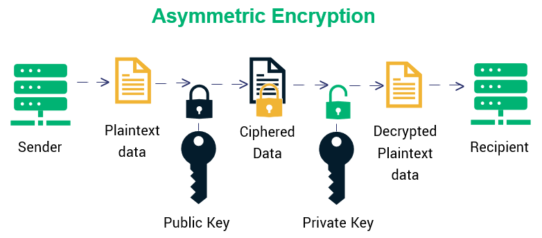

# Software and Systems Security

## Given a scenario, apply security solutions for infrastructure management.

### Public Cloud vs. on-premises

With Public Cloud notes that:

- There are **new security controls to put in place**
- As you leverage the *Shared Responsability*, they are responsible for some controls that they can potientially better master at scale
- You **may not acheive some advanced requirements** for certains kinds of extremely sensitive date (such as national intelligence)

It may be also difficult to move into another environment if you have sunk costs

### Asset management

IT asset management (also known as ITAM) is the process of ensuring an organization’s assets are accounted for, deployed, maintained, upgraded, and disposed of when the time comes.

#### Asset tagging

Asset tagging is the process of affixing identification tags or labels, also known as asset tags, to assets. Asset tagging is used for both fixed and moveable assets to provide a way to identify individual assets throughout their useful life.

Asset should be tagged and within the asset inventory **upon reception**

They are automared asset tools that can take advantages of machine-readable code to make the process faster with:

- barcode
- Quick Response (QR) code
- radio frequency identification (RFID)

RFID has an additional benefits of supporting *Geofencing*. 
Geofencing is a location-based service in which an app or other software program uses radio frequency identification (RFID), Wi-Fi, GPS, or cellular data to trigger a targeted marketing action

### Segmentation

Network segmentation in computer networking is the act or practice of splitting a computer network into subnetworks, each being a network segment.

Advantages are:

- **Reduced congestion**: Improved performance is achieved, because on a segmented network there are fewer hosts per subnetwork, thus minimizing local traffic
- **Improved security**:
  - Broadcasts will be contained to local network.
  - There is a reduced attack surface available to pivot in if one of the hosts on the network segment is compromised.
   - By creating network segments containing only the resources specific to the consumers that you authorise access to, you are creating an environment of least privilege
- **Containing network problems**: Limiting the effect of local failures on other parts of network
- **Controlling visitor access**: Visitor access to the network can be controlled by implementing VLANs to segregate the network

#### Virtual

A virtual LAN (VLAN) is any broadcast domain that is partitioned and isolated in a computer network at the data link layer (OSI layer 2).
VLANs work by applying tags to network frames and handling these tags in networking systems – creating the appearance and functionality of network traffic that is physically on a single network but acts as if it is split between separate networks.

#### Physical

Most organizations use a mixture of both virtual and physical segmentation.
For instance, you may have:

- Physical switches for the DMZ network with multiple VLANs 
- Physical switches for the Production network with multiple VLANs
- ....

#### Jumpbox

A jump box is a system on a network used to **access and manage devices in a separate security zone**.

A jump server is a hardened and monitored device that spans two dissimilar security zones and provides a controlled means of access between them.

jump boxes are usually highly controlled with:

- Extended logging enabled for auditing
- Recording capabilites
- ...

By inforcing the use of jump box to access crown jewels assets, it make also the task more difficult for attackers.

#### System isolation

In order to ensure that system virtualized are not capabable to talk with other virtualized with different risk profile.
This is done to protect from **virtual machine escape attacks**

For instance, some regulatory bodies ask that all virtual machines running on an hypervisors have the same risk profil than his underlying type 1 hypervisor.

##### Air gap

An air gap or disconnected network is a network security measure employed on one or more computers to ensure that a secure computer network is physically isolated from unsecured networks, such as the public Internet or an unsecured local area network

### Network architecture

Network architecture is the **design of a computer network**, including security solutions.
It is a framework for the specification of a network's physical components and their functional organization and configuration, its operational principles and procedures, as well as communication protocols used.

A network architecture should be seen a military plan, where you know your troops are, and anticipate for enemy attacks.
Together with CTI, this can be very usefull for improving cyber security posture

#### Physical Network

The physical network is easy to understand because it’s usually visible. 
Mainly, it consists of hardware: the wiring, plugs such as computer ports, printers, mail servers, and other devices that process and store our data.

#### Software-Defined Network

Software-defined networking (SDN) technology is an approach to network management that enables dynamic, programmatically efficient network configuration in order to improve network performance and monitoring, making it more like cloud computing than traditional network management.

SDN is meant to address the fact that the static architecture of traditional networks is decentralized and complex while current networks require more flexibility and easy troubleshooting.

#### Virtual private cloud (VPC)

Virtual private cloud network is a logical container used to provision resources in

#### Virtual private network (VPN)

A virtual private network (VPN) **extends a private network across a public network** and enables users to send and receive data across shared or public networks as if their computing devices were directly connected to the private network.

Here are some drawbacks from using VPNs:

- As this solution terminate all remote user connections, it may create a bottlenecks if the capacity is not monitor
- This bring a new asset that is internet facing, and so, increase your attack surface

##### Split tunneling

Split tunneling is a computer networking concept which allows a user to access dissimilar security domains like a public network (e.g., the Internet) and a local LAN or WAN at the same time, using the same or different network connections.
This can be done with VPN as well.

#### Serverless

There is a concept about *serverless network* where you don't manage almost any network devices.
For instance, a Function-as-a-Service script getting a resources from a Storage-as-a-Service repository.

### Change management

Change management is a collective term for all approaches to prepare, support, and help individuals, teams, and organizations in making organizational change.

Usually, there are the following roles in this process:

- **Requestor**: The individual responsible for initiating, preparing, and submitting a change request.
- **Validator**: The individual responsible for the initial approval of a change request
- **Owner/Assignee/Implementor**: The individual deemed as an owner of the change request throughout the request lifecycle.

#### Side Note : Change Advisory Board

A change-advisory board (CAB) delivers support to a change-management team by advising on requested changes, assisting in the assessment and prioritization of changes.

### Virtualization

#### Virtual desktop infrastructure (VDI)

Virtual Desktop Infrastructure is a software technology that separates the desktop environment and associated application software from the physical client device that is used to access it.

Desktops as a Service (DaaS) delivers virtual applications and desktop services via a public or private cloud service. Your workforce can access this service through an internet connection via an html-based web browser or a secure application downloaded to a device such as a laptop, desktop, thin client or tablet.

VDI can be usefull as it supports data retention, configuration management, and incident response.
It can be also usefull if your workfore is highly mobile.

#### Containerization

A container is a standard unit of software that packages up code and all its dependencies so the application runs quickly and reliably from one computing environment to another.

It works as an operating system paradigm in which the kernel allows the existence of multiple isolated user space instances.

### Identity and access management

#### Privilege management

Privilege management is crucial within an organization but may be complex:

- There are a lots of differents roles
- There are a lots of differents access:
  - Environment: Test, development, production
  - Data: Based on the data classification and criticality
  - Systems: Network Devices, Databases, ...
  - Applications: Internal applications, Cloud Applications, ...

Enforcing least privileges is an **ongoing challenge**

Authorization creep occurs when an employee changes from one role or position to another and acquires an increase in additional permissions and privileges, without having their previous privileges properly withdrawn.

Here are best practises regarding privileged accounts:

- Use multifactor authentication
- Have as less as possible privileged accounts
- Use privileged accounts only when needed
- Make sure that there are no shared accounts
- Keep a inventory of accounts
- Monitor privileged action 

#### Multifactor authentication (MFA)

Multi-factor authentication is an electronic authentication method in which a device user is granted access to a website or application only after successfully presenting two or more pieces of evidence (or factors) to an authentication mechanism.

Factors are:

- **Knowledge**: something only the user knows
- **Possession**: something only the user has
- **Inherence**: something only the user is 

#### Single sign-on (SSO)

Single sign-on (SSO) is an authentication scheme that allows a user to log in with a single ID and password to any of several related, yet independent, software systems.

Single sign-on allows the user to **log in once** and access services **without re-entering authentication factors**.

Benefits of using single sign-on include:

- Mitigate risk for access to 3rd-party sites ("federated authentication") because user passwords not stored or managed externally
- Reduce password fatigue from different username and password combinations
- Reduce time spent re-entering passwords for the same identity
- Reduce IT costs due to lower number of IT help desk calls about passwords

##### SAML

SAML is an open standard for exchanging authentication and authorization data between parties, in particular, between an identity provider and a service provider. SAML is an XML-based markup language for security assertions (statements that service providers use to make access-control decisions).

#### Federation

A federated identity is the means of linking a person's electronic identity and attributes, stored **across multiple distinct identity management systems**.

FIdM, or the "federation" of identity, describes the technologies, standards and use-cases which serve to enable the portability of identity information across otherwise autonomous security domains. The ultimate goal of identity federation is to enable users of one domain to securely access data or systems of another domain seamlessly, and without the need for completely redundant user administration. Identity federation comes in many flavors, including "user-controlled" or "user-centric" scenarios, as well as enterprise-controlled or business-to-business scenarios.

##### OpenID

OpenID is an open standard and decentralized authentication protocol
OpenID allows users to be authenticated by co-operating sites (known as relying parties, or RP) using a third-party service, eliminating the need for webmasters to provide their own ad hoc login systems, and allowing users to log into multiple unrelated websites without having to have a separate identity and password for each.

OpenID, currently in version 2.0, defines three roles:

- End user
- Relying party
- OpenID provider


#### Role-based

Role-based access control (RBAC) is a policy-neutral access-control mechanism defined around **roles** and **privileges**.

Three primary rules are defined for RBAC:

- **Role assignment**: A subject can exercise a permission only if the subject has selected or been assigned a role.
- **Role authorization**: A subject's active role must be authorized for the subject. With rule 1 above, this rule ensures that users can take on only roles for which they are authorized.
- **Permission authorization**: A subject can exercise a permission only if the permission is authorized for the subject's active role. With rules 1 and 2, this rule ensures that users can exercise only permissions for which they are authorized.

Note that when the rights and permissions are assigned **explicitly**, they are assigned **directly** to a specific individual. 
Otherwise, when the right are assigned **implicitly**, they are assigned to a role or group and the user inherits those attributes

#### Attribute-based

Attribute-based access control (ABAC), also known as policy-based access control for IAM, defines an access control paradigm whereby access rights are granted to users through the use of policies which combine attributes together.

Attributes can be about anything and anyone. They tend to fall into 4 different categories:

- **Subject**: Describe the user attempting the access e.g. age, clearance, department, role, job title...
- **Action**: Describe the action being attempted e.g. read, delete, view, approve...
- **Object**: Describe the object (or resource) being accessed e.g. the object type (medical record, bank account...), the department, the classification or sensitivity, the location...
- **Contextual**: Deal with time, location or dynamic aspects of the access control scenario

Although the concept itself existed for many years, ABAC is considered a "next generation" authorization model because it provides dynamic, context-aware and risk-intelligent access control to resources allowing access control policies that include specific attributes from many different information systems to be defined to resolve an authorization and achieve an efficient regulatory compliance, allowing enterprises flexibility in their implementations based on their existing infrastructures.

#### Mandatory

Mandatory access control (MAC) refers to a type of access control by which the operating system or database constrains the ability of a subject or initiator to access or generally perform some sort of operation on an object or target.

For instance, within military environment we have the security level of the file which is the **classification level** and the security level of the subject which is **clearance level**.

#### Manual review

Auditing and analysis of login events is very important.
You should not only focus on the failed attempts. Also it it important to correlate with other events.
### Cloud access security broker (CASB)

A cloud access security broker (CASB) is on-premises or cloud based software that **sits between cloud service users and cloud applications**, and monitors all activity and enforces security policies.

Usually, a CASB as the four following use-cases:

- **Visibility**: Who is doing what, when and where ?
- **Threat Protection**: Detect (and even block) suspicious activities **based on activites**
- **Compliance**: Monitor regulated data such as PII
- **Data Security**: Monitor IP, customer data, ..

### Honeypot 

A honeypot is a computer security mechanism set to **detect, deflect, or counteract** attempts at unauthorized use of information systems.
A honeypot consists of data (for example, in a network site) that **appears to be a legitimate** part of the site and contain information or resources of value to attackers.

Honeypots can be classified based on their deployment (use/action) and based on their level of involvement. Based on deployment, honeypots may be classified as:

- **Production honeypots** are placed inside the production network with other production servers by an organization to improve their overall state of security. Normally, production honeypots are low-interaction honeypots, which are easier to deploy.
- **Research honeypots** are run to gather information about the motives and tactics of the black hat community targeting different networks.

A **honeynet** is a network set up with **intentional vulnerabilities**.
Its purpose is to invite attack, so that an attacker's activities and methods can be studied and that information used to increase network security. **A honeynet contains one or more honey pots**, which are computer systems on the Internet expressly set up to attract and "trap" people who attempt to penetrate other people's computer systems.

### Monitoring and logging

Monitoring is the process of making sure that your environment is working as expected.

Here are some concepts to know:

- **Real user monitoring (RUM)** is a passive monitoring technology that records all user interaction with a website or client interacting with a server or cloud-based application.
- **Logging** is the process of using a computer to collect data through sensors, analyze the data and save and output the results of the collection and analysis.
- **Data Aggregation** is the process of gathering data and presenting it in a summarized format. The data may be gathered from multiple data sources with the intent of combining these data sources into a summary for data analysis
- **Data normalization** is the organization of data to appear similar across all records and fields
- **Pattern recognition** is the automated recognition of patterns and regularities in data.
- **Predictive analytics** encompasses a variety of statistical techniques from data mining, predictive modelling, and machine learning that analyze current and historical facts to make predictions about future or otherwise unknown events.
- **Classification**


### Encryption

Encryption is the process of encoding information.
This process converts the original representation of the information, known as plaintext, into an alternative form known as ciphertext.

This is part of cryptography, the practice and study of techniques for secure communication in the presence of third parties called adversaries.

Encryption has long is used to facilitate the protection of data in transit and data at rest.

#### Symmetric Cryptography

Symmetric encryption is a type of encryption where only one key (a secret key) is used to both encrypt and decrypt electronic information.


#### Asymmetric Cryptography



##### Digital Signatures

A digital signature is a mathematical scheme for verifying the authenticity of digital messages or documents. A valid digital signature, where the prerequisites are satisfied, gives a recipient very strong reason to believe that the message was created by a known sender (authentication), and that the message was not altered in transit (integrity).

a certificate revocation list (or CRL) is a list of digital certificates that have been revoked by the issuing certificate authority (CA) before their scheduled expiration date and should no longer be trusted.

#### Symmetric vs. Asymmetric Cryptography

### Certificate management

### Active defense

## Explain software assurance best practices.

### Platforms

Presentation
Business Logic
Data

Distributed applications

#### Mobile

#### Web application

A web applicationis application software that runs on a web server, unlike computer-based software programs that are run locally on the operating system (OS) of the device. Web applications are accessed by the user through a web browser with an active network connection.

Web applications are known to be a lot of threats.

#####  OWASP Top Ten


#### Client/server

#### Embedded

#### System-on-chip (SoC)

#### Firmware

### Software development life cycle (SDLC) integration

#### Requirements

Define project goals into defined functions and operations of the intended application. This involves the process of gathering and interpreting facts, diagnosing problems, and recommending improvements to the system.

A series of steps followed by the developer include:
- **Collection of facts**: Obtain end user requirements through documentation, client interviews, observation, and questionnaires.
- **Scrutiny of the existing system**: Identify pros and cons of the current system in-place, so as to carry forward the pros and avoid the cons in the new system.
- **Analysis of the proposed system**: Find solutions to the shortcomings described in step two and prepare the specifications using any specific user proposals.

##### Functional Requirements

A **Functional Requirement** is a description of the service that the software must offer.
It describes a software system or its component. A function is nothing but inputs to the software system, its behavior, and outputs.

##### Nonfunctional Requirements

non-functional requirement is a requirement that specifies criteria that can be used to judge the operation of a system, rather than specific behaviors.
They maybe called *quality requirements*.

##### Security Requirements

A security requirement is a statement of needed security functionality that ensures one of many different security properties of software is being satisfied. Security requirements are derived from industry standards, applicable laws, and a history of past vulnerabilities. Security requirements define new features or additions to existing features to solve a specific security problem or eliminate a potential vulnerability.

*Note that this is actually the first requirement of the OWASP Top Ten Proactive Controls 2018*

### Development

The first stage within development is to design an architecture that meets the nonfunctional requirements.
Then, functional requirements needs to be meet.
After the architecture and features are designed,software engineers start writing, integrating, and testing the code

#### Testing

Broadly speaking, there are at least three levels of testing: unit testing, integration testing, and system testing.
However, a fourth level, acceptance testing, may be included by developers.

1) Unit testing: Refers to tests that verify the functionality of a specific section of code, usually at the function level. In an object-oriented environment, this is usually at the class level, and the minimal unit tests include the constructors and destructors.
2) Integration tesing: Seeks to verify the interfaces between components against a software design.
3) System testing: Verify that the system meets its requirements.
4) Acceptance testing: a test conducted to determine if the requirements of a specification or contract are met. 

#### Implementation

Systems engineers and developers transition the system to its final production environment, where it is intended to be used by its end users and supported by its support and operations staff.

#### Operation and Maintenance

The deployment of the system includes changes and enhancements before the decommissioning or sunset of the system. Maintaining the system is an important aspect of SDLC. As key personnel change positions in the organization, new changes will be implemented.

A common perception of maintenance is that it merely involves fixing defects.

### DevSecOps

### Software assessment methods

#### User acceptance testing

User acceptance testing (UAT) consists of a process of **verifying that a solution works for the user.**
It is not system testing (ensuring software does not crash and meets documented requirements) but rather ensures that the solution will work for the user (i.e. tests that the user accepts the solution).

The UAT acts as a **final verification** of the required business functionality and proper functioning of the system, emulating real-world conditions on behalf of the paying client or a specific large customer.

Software vendors often refer to this as "Beta testing".

#### Stress test application

Stress testing is a form of deliberately **intense** or thorough testing used to **determine the stability of a given system**. It involves testing beyond normal operational capacity, often to a breaking point, in order to observe the results.

The goals of such tests may be to ensure the software does not crash in conditions of insufficient computational resources (such as memory or disk space), unusually high concurrency, or denial of service attacks.

One of the goal is to test the software **against resource starvation attacks**

Resource starvation is a problem encountered in concurrent computing where a process is perpetually denied necessary resources to process its work.

#### Security regression testing

Regression testing is re-running functional and non-functional tests to ensure that previously developed and tested software still performs after a change

- Functional testing is a **quality assurance (QA) process** and a type of black-box testing that bases its test cases on the specifications of the software component under test.
Functional testing is conducted to **evaluate the compliance of a system or component with specified functional requirements**.
- Non-functional testing is the testing of a software application or system for its non-functional requirements: the way a system operates, rather than specific behaviours of that system.

#### Code review

### Secure coding best practices

#### Input validation

Input validation is performed to ensure only properly formed data is entering the workflow in an information system, preventing malformed data from persisting in the database and triggering malfunction of various downstream components. 

Input validation should happen as early as possible in the data flow, preferably as soon as the data is received from the external party.

The most common input validation attacks include Buffer Overflow, XSS attacks and SQL injection

##### Client Side vs Server Side Validation

Client-side validation is an initial check and an important feature of good user experience; by catching invalid data on the client-side, the user can fix it straight away. If it gets to the server and is then rejected, a noticeable delay is caused by a round trip to the server and then back to the client-side to tell the user to fix their data.

Be aware that some input validation performed on the client can be bypassed by an attacker.
Ensure that any input validation performed on the client is also performed on the server.


##### Allow list vs block list

It is a common mistake to use block list validation in order to try to detect possibly dangerous characters and patterns like the apostrophe ' character, the string 1=1, or the \<script> tag, but this is a massively flawed approach as it is trivial for an attacker to bypass such filters.

Allow list validation is appropriate for all input fields provided by the user. Allow list validation involves defining exactly what IS authorized, and by definition, everything else is not authorized.

#### Output encoding

One of the purpose of output encoding is to **convert untrusted input into a safe form** where the input is displayed as data to the user without executing as code in the browser.

This is one of the most efficient measure against XSS attacks

#### Session management

#### Authentication

#### Data protection

##### Data at Rest

Data at rest is one of the three states of digital data and it refers to any digital information that is stationary and contained within permanent storage devices, such as hard drives and tapes, or information reservoirs such as off-site backups, databases, archives, etc.

##### Data in Motion

Data in motion is a term used to label any digital information that is being transferred from one location to another.

The single best protection is to encrypt the protection when they are in transit using TLS or IPSec.

##### Data in Use


#### Parameterized queries

SQL Injection is usually best prevented through the use of parameterized queries.

A parameterized query is a type of SQL query that requires at least one parameter for execution. A placeholder is normally substituted for the parameter in the SQL query. The parameter is then passed to the query in a separate statement.

Here below is an example in Python

```python
import mysql.connector

try:
    connection = mysql.connector.connect(host='localhost',
                                         database='python_db',
                                         user='root')

    cursor = connection.cursor(prepared=True)
    # Parameterized query
    sql_insert_query = """ INSERT INTO Employee
                       (id, Name, Joining_date, salary) VALUES (%s,%s,%s,%s)"""
    # tuple to insert at placeholder
    tuple1 = (1, "Json", "2019-03-23", 9000)
    tuple2 = (2, "Emma", "2019-05-19", 9500)

    cursor.execute(sql_insert_query, tuple1)
    cursor.execute(sql_insert_query, tuple2)
    connection.commit()
    print("Data inserted successfully into employee table using the prepared statement")

except mysql.connector.Error as error:
    print("parameterized query failed {}".format(error))
finally:
    if connection.is_connected():
        cursor.close()
        connection.close()
        print("MySQL connection is closed")
```

### Static analysis tools

### Dynamic analysis tools

Code coverage

### Formal methods for verification of critical software

Formal methods

### Service-oriented architecture

Service-oriented architecture (SOA) is an architectural style that supports service orientation.

By consequence, it is as well applied in the field of software design where services are provided to the other components by application components, through a communication protocol over a network.

SOA is related to the idea of an **application programming interface** (API), an interface or communication protocol between different parts of a computer program intended to simplify the implementation and maintenance of software.

SOA is usually within HTTP application with messaging protocol like SOAP and REST

#### Simple Object Access Protocol (SOAP)

SOAP is a messaging protocol specification for exchanging structured information in the implementation of web services in computer networks. 
It uses XML Information Set for its message format, and relies on application layer protocols, most often Hypertext Transfer Protocol (HTTP), although some legacy systems communicate over Simple Mail Transfer Protocol (SMTP), for message negotiation and transmission.

SOAP allows developers to invoke processes running on disparate operating systems (such as Windows, macOS, and Linux) to authenticate, authorize, and communicate using Extensible Markup Language (XML). 

SOAP provides the Messaging Protocol layer of a web services protocol stack for web services. It is an XML-based protocol consisting of three parts:

- an envelope, which defines the message structure[1] and how to process it
- a set of encoding rules for expressing instances of application-defined datatypes
- a convention for representing procedure calls and responses

SOAP is not, it tend to be complex and this is why many web service developers prefer more lightweight options like REST.

#### Representational State Transfer (REST)

Representational state transfer (REST) is a software architectural style which uses a subset of HTTP.
It is commonly used to create interactive applications that use Web services.

#### Security Assertions Markup Language (SAML)

Security Assertion Markup Language is an open standard for exchanging authentication and authorization data between parties, in particular, between an identity provider and a service provider. 

#### Microservices

a loosely coupled system is one in which each of its components has, or makes use of, little or no knowledge of the definitions of other separate components.

## Explain hardware assurance best practices

### Hardware root of trust

#### Trusted platform module (TPM)

#### Hardware security module (HSM)

### eFuse

### Unified Extensible Firmware Interface (UEFI)

### Trusted foundry

### Secure processing

#### Trusted execution

#### Secure enclave

#### Processor security extensions

#### Atomic execution

### Anti-tamper

### Self-encrypting drive

### Trusted firmware updates

### Measured boot and attestation

### Bus encryption


## References:

- <https://www.informit.com/articles/article.aspx?p=1353367&seqNum=4#>
- <https://www.docker.com/resources/what-container>
- <https://searchsecurity.techtarget.com/definition/honeynet>
- <https://www.atlassian.com/itsm/it-asset-management>
- <https://www.camcode.com/asset-tags/6-steps-in-asset-tagging-process-flow>
- <https://www.smartbugmedia.com/blog/what-is-geofencing>
- <https://www.bmc.com/blogs/change-management-roles/>
- <https://www.skillset.com/questions/authorization-creep-is-a-direct-violation-of-least-privilege-what-is-authorization-creep>
- <https://cheatsheetseries.owasp.org/cheatsheets/Input_Validation_Cheat_Sheet.html>
- <https://www.guru99.com/functional-requirement-specification-example.html>
- <https://owasp.org/www-project-proactive-controls/v3/en/c1-security-requirements>
- <https://www.techopedia.com/definition/24414/parameterized-query>
- <https://pynative.com/python-mysql-execute-parameterized-query-using-prepared-statement/>
- <https://www.manageengine.com/device-control/data-in-motion.html>
- <https://www.import.io/post/what-is-data-aggregation-industry-examples/>