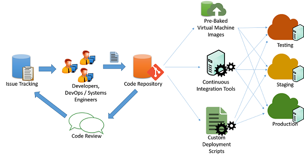

## Introduction

The deployment of a cloud application is an iterative process that starts from the end of development and continues right through to the release of the application on the production resources:

Changes to the code are maintained through a code repository system.
After passing through code changes, reviews, and approvals, the code can be pipelined into the testing, staging, and production phases. This can be done in multiple ways:

- **Custom scripts**: Developers can use custom scripts to pull the latest version of the code and run specific commands to build the application and bring it into a production state.
- **Pre-baked virtual machine images**: Developers can also provision and configure a virtual machine with all the required environment and software to deploy their application.
- **Continuous integration systems**: In order to simplify the various tasks that are involved in deployment, continuous integration (CI) tools can be used to automate tasks (such as retrieval of the latest version from a repository, building application binaries, and running test cases) that need to be completed in the various machines that make up the production infrastructure.

### Manage downtime

Applications that are designed for continuous integration may be able to perform these changes live on production systems with minimal or no interruption to the application's clients.

### Redundancy and fault tolerance

Best practices in application deployment typically assume that cloud infrastructure is ephemeral and may be unavailable or change at any moment.

Well-designed applications should ideally use service APIs to query and discover resources and connect to them in a dynamic fashion.

### Security and hardening in production

Some very basic principles that should be followed include:

- **All software should be switched to production mode**: Most software supports "debug mode" for local testing and "production mode" for actual deployments.
- **Access to nonpublic services should be restricted to certain internal IP addresses for admin access**: Make sure that administrators cannot directly log in to a critical resource from the internet without visiting an internal launchpad.
- **Follow the principle of least privilege**: Run all services as the least privileged user that can perform the required role. Restrict the use of root credentials to specific manual logins by system administrators who need to debug or configure some critical problems in the system.
- **Use well-known defensive techniques and tools**: Use intrusion detection and prevention systems (IDS/IPS), security information and event management (SIEM), application-layer firewalls, and anti-malware systems.
- **Vulnerability Management**: Set up a patching schedule that coincides with patch releases by the vendor of the systems that you use. Often, vendors like Microsoft have a fixed release cycle for patches.

## Develop deployment scripts and templates

### Recommend a deployment solution (e.g., GitHub Actions, Azure Pipelines, Jenkins, CircleCI, etc.)

#### GitHub Actions

#### Azure Pipelines

#### Jenkins

Pros:

- Jenkins is an **open-source** project
- Jenkins is undoubtedly the **most well-known tool for building CI/CD pipelines**.
- Jenkins is able to support any complex build and test environment needed for CI/CD.
- The entire CI/CD pipeline can be written as code using the Groovy language.

Cons:

- Jenkins often requires a **higher operational management**

Jenkins architecture is divided into two parts:

- A controller server that orchestrates the necessary actions for each project CI/CD pipeline
- One or more agent nodes that execute those defined steps.

#### CircleCI

Pros:

- CircleCI is a popular **SaaS solution**
- CircleCI has **GPU support**
- CircleCI has **macOS builds**

#### TravisCI

Pros:

- Travis CI is a popular **SaaS solution**

Travis is a **developer-friendly** solution for organizations that want **modern features** and a **low operational overhead**.

### Design and implement Infrastructure as code (ARM, Terraform, PowerShell, CLI)

#### Definition

Infrastructure as code is the management of infrastructure - such as networks, virtual machines, load balancers, and connection topology - in a **descriptive model**, using a **versioning system** that is similar to what is used for source code.

Infrastructure as code evolved to solve the problem of **environment drift**.
When team maintain individually systems, each environment becomes a **snowflake** that is increasingly unique, and cannot be reproduced automatically.

When automating the deployment of services and infrastructure, there are two different approaches you can take: imperative and declarative.

- With an **imperative approach**, you **explicitly state** the commands that are executed to produce the outcome you are looking for. With imperative automation, we're specifying how things are to be done. This is typically done programmatically through a scripting language or SDK
- With a **declarative approach**, you specify **what you want instead of how you want it done**. With declarative automation, we're specifying what we want our result to be, leaving the details of how it's done to the system we're using.

On Azure, declarative automation is done through the use of Azure Resource Manager (ARM) templates, which are JSON-structured files that specify what we want created.

#### ARM Templates

ARM templates have four sections:

- Parameters handle input to be used within the template.
- Variables provide a way to store values for use throughout the template.
- Resources are the things that are being created.
- Outputs provide details to the user of what was created.

### Develop application deployment process (container, binary, scripts)

### Develop database deployment process (migrations, data movement, ETL)

### Integrate configuration management as part of the release process

Configuration management (CM) is a systems engineering process for establishing and maintaining consistency of a product's performance, functional, and physical attributes with its requirements, design, and operational information throughout its life.

There are two common strategies that you can use for the configuration work, which for all intents and purposes are considered to be part of the configuration process for the VM itself, and each of these strategies has its advantages and disadvantages.

- **Custom images**: are generated by deploying a virtual machine, and then configuring or installing software on that running instance. When everything is configured correctly, the virtual machine can be shut down, and an image is created from the VM.
- **Post-deployment scripting**: typically leverages a basic base image, and then relies on scripting or a configuration management platform to perform the necessary configuration after the VM is deployed. The post-deployment scripting could be done by executing a script on the VM through the **Azure Script Extension**, or by leveraging a more robust solution such as **Azure Automation Desired State Configuration (DSC)**.

Once your solutions are up and running, there are ongoing operational activities that can also be automated.

Examples of this automation might include:

- Periodically searching for orphaned disks
- Installing the latest security patches on VMs
- Searching for and shutting down virtual machines in off-hours
- Running daily reports and producing a dashboard to report to senior management

### Develop complex deployments (IoT, Azure IoT Edge, mobile, App Center, DR, multiregion, CDN, sovereign cloud, Azure Stack, etc.)

## Implement an orchestration automation solution

### Combine release targets depending on release deliverable (e.g., Infrastructure, code, assets, etc.)

### Design the release pipeline to ensure reliable order of dependency deployments

### Organize shared release configurations and process (YAML templates, variable groups, Azure App Configuration)

### Design and implement release gates and approval processes

## Plan the deployment environment strategy

### Design a release strategy (blue/green, canary, ring)

### Implement the release strategy (using deployment slots, load balancer configurations, Azure Traffic Manager, feature toggle, etc.)

### Select the appropriate desired state solution for a deployment environment (PowerShell DSC, Chef, Puppet, etc.)

### Plan for minimizing downtime during deployments (VIP Swap, Load balancer, rolling deployments, etc.)

### Design a hotfix path plan for responding to high priority code fixes
