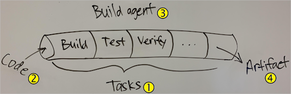
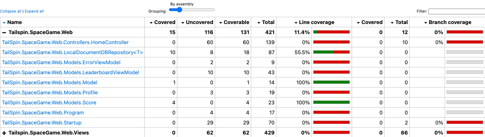
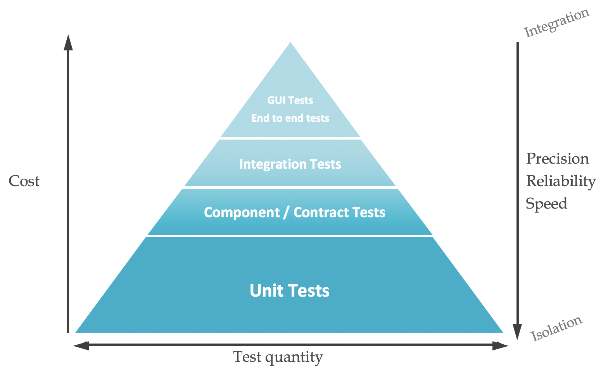

## Introduction to Lean product development

### Introduction

Lean product development (LPD) is a lean approach to counter the challenges of product development, notably:

- Lack of innovative solutions
- Long development cycle times
- Many redevelopment cycles
- High development costs
- Long production cycle times
- High production costs

The most common high level concepts associated with lean product development are:

- **Creation of re-usable knowledge**: Knowledge is created and maintained so that it can be leveraged for successive products or iterations.
- **Set-based concurrent engineering**: Different stages of product development run simultaneously rather than consecutively to decrease development time, improve productivity, and reduce costs.
- **Teams of responsible experts**: Lean product development organizations develop cross-functional teams and reward competence building in teams and individuals.
- **Cadence and pull**: Managers of lean product development organizations develop autonomous teams, where engineers plan their own work and work their own plans.
- **Visual management**: Visualization is a main enabler of lean product development.
- **Entrepreneurial system designer**: The lean product development organization makes one person responsible for the engineering and aesthetic design, and market and business success, of the product.
- **Flow management**

### Value Stream Map

a Value Stream Map helps us **measure where a process has value to the customer** and **where it's eating up time without producing any value**.

- **Development processes**:
- **Testing processes**:
- **Operations processes**:

Here are some key performance metrics:

- **Total lead time**: time it takes for a feature to make it to the customer.
- **Process time**: time spent on a feature that has value to the customer. For instance:
  - 3 days of coding
  - 1 day of testing
  - 1 day for deployment
- **Activity ratio**: Efficiency

Activity Ratio help us to pinpoint the areas where there's waste. We want to minimize the time we spend that has no value to the customer.

**Waste is time spent on tasks that don't have direct customer value.**

### Azure Pipelines Introduction

<https://docs.microsoft.com/en-us/azure/devops/pipelines/get-started/key-pipelines-concepts?view=azure-devops>
<https://docs.microsoft.com/en-us/azure/devops/pipelines/process/runs?view=azure-devops>

## Design build automation

### Explain the concept of continuous integration

#### What is continuous integration ?

**Continuous integration (CI)** is the process of **automating the build and testing** of code every time a team member commits changes to version control.

CI encourages developers to share their code and unit tests by merging their changes into a **shared version control repository after every small task completion**.



- **CI** is the process of automating the build and testing of code every time a team member commits changes to version control.
- A **pipeline** defines the continuous integration process for the app.
  - It's made up of steps called **tasks (1)**
  The pipeline runs when you submit code changes **(2)**
- A **build agent** builds or deploys the code. **(3)** When your build or deployment runs, the system begins one or more jobs. An agent is installable software that runs one build or deployment job at a time.
Generally it:
  - **build**
  - **test**
  - **verify**
- The final product of the pipeline is a **build artifact (4)**

### Integrate the build pipeline with external tools (e.g., Dependency and security scanning, Code coverage)

#### Code coverage

Azure Pipelines supports **Cobertura** and **JaCoCo** coverage result formats.
To convert **Cobertura** coverage results to a format that's human-readable, they can use a tool called **ReportGenerator**

Here below is an example using **Coverlet** to perform code coverage

```bash
dotnet test --no-build \
  --configuration Release \
  /p:CollectCoverage=true \
  /p:CoverletOutputFormat=cobertura \
  /p:CoverletOutput=./TestResults/Coverage/
```



### Implement quality gates (e.g., code coverage, internationalization, peer review)

<https://docs.microsoft.com/en-us/azure/devops/pipelines/release/approvals/?view=azure-devops>

### Design a testing strategy (e.g., integration, load, fuzz, API, chaos)

Testing is one of the fundamental components of DevOps and agile development in general. If automation gives DevOps the required speed and agility to deploy software quickly, only through extensive testing will those deployments achieve the required reliability that customers demand.

A main tenet of a DevOps practice to achieve system reliability is the **shift left** principle.

Testing should occur on **both application code and infrastructure code**, and they should both be subject to the same quality controls.

#### Automated Testing

Automating tests is the best way to make sure that they are executed.

When you relate testing to continuous integration and continuous delivery pipelines, two concepts you'll hear about are:

- **Continuous testing**: tests are run early in the development process and as every change moves through the pipeline.
- **Shifting left**: considering software quality and testing earlier in the development process.

The tradeoff is that developers might need to dedicate more time to writing and maintaining their test code.

But the added benefits are:

- **Documentation**: Manual test plans can serve as a type of documentation as to how software should behave and why certain features exist.
- **Refactoring**: Automated tests serve as a type of contract. That is, you specify the inputs and the expected results. When you have a set of passing tests, you're better able to experiment and refactor your code.

##### The Test Pyramid

When we think about automated testing, it's common to separate tests into layers.



##### What makes a good test?

- **Don't test for the sake of testing**: Your tests should serve a purpose beyond being a checklist item to cross off.
- **Keep your tests short**: Tests should finish as quickly as possible, especially those that happen during the development and build phases.
- **Ensure that your tests are repeatable**: Test runs should produce the same results each time, whether you run them on your computer, a coworker's computer, or in the build pipeline.
- **Keep your tests focused**: A common misconception is that tests are meant to cover code written by others.
- **Choose the right granularity**

##### Unit Testing

Unit tests are tests typically run by **each new version of code that is committed** into your version control system. Unit Tests should be **extensive** (should cover ideally 100% of the code), and **quick** (typically under 30 seconds, although this number is not a rule set in stone). Unit testing could verify things like the syntax correctness of application code, Resource Manager templates or Terraform configurations.

##### Smoke Testing

Smoke tests usually involve building the application code; and if you're deploying infrastructure as part of your process, then possibly testing the deployment in a test environment.

##### Integration Testing

Integration testing determines whether your components **can interact with each other** as they should.

Integration tests usually take **longer than smoke testing**, and as a consequence, they are sometimes executed less frequently.

##### UI test

Naturally, the quality of the user interface decides the user’s first (and last) impression of a website or app. UI design and functionality make or break the software, which is why developers and testers have increasingly focused on UI testing (User Interface Testing) as an important part of the development blueprint.

**Selenium** is a portable framework for testing web applications. Selenium provides a playback tool for authoring functional tests without the need to learn a test scripting language (Selenium IDE). It also provides a test domain-specific language (Selenese) to write tests in a number of popular programming languages, including C#, Groovy, Java, Perl, PHP, Python, Ruby and Scala.

#### Manual Testing

Manual testing is **much more expensive than automated testing**, and as a consequence it is used less frequently than automated testing.

##### Acceptance Testing

There are many different ways of confirming that the application is doing what it should.

- **Blue/Green deployments**: when deploying a new application version, you can deploy it in parallel to the existing one.
- **Canary releases**: you can expose new functionality of your application (ideally using feature flags) to a select group of users.
- **A/B testing**: A/B testing is similar to canary release testing, but while canary releases focus on mitigating risk, A/B testing focuses on evaluating the effectiveness of two similar ways of achieving the same goal.

##### Stress tests

It is critical that you test whether your application and infrastructure code will both be able to adapt to changing load conditions

During your stress tests, it is critical that you monitor all the components of the system in order to identify whether there are any scale limitations.

##### Fault injection

Your application should be resilient to infrastructure failures, and introducing faults in the underlying infrastructure and observing how your application behaves is fundamental for increasing the trust in your redundancy mechanisms.

**Chaos engineering** is a practice adopted by some organizations to identify areas where faults may occur by purposefully making key pieces of infrastructure unavailable.

##### Security tests

Another critical component of your test strategy should be routine testing of your application for **security vulnerabilities**. You should regularly perform security tests against your application to identify any application vulnerabilities that are introduced through code defects or through software dependencies.

### Integrate multiple tools (e.g., GitHub Actions, Azure Pipeline, Jenkins)

## Design a package management strategy

### Recommend package management tools (e.g., GitHub Packages, Azure Artifacts, Azure Automation Runbooks Gallery, Nuget, Jfrog, Artifactory)

A **package** contains reusable code that other developers can use in their own projects, even though they didn't write it.

For **compiled languages**, a package typically contains the **compiled binary code**, such as .dll files in .NET, or .class files in Java.

For languages that are **interpreted** instead of compiled, such as JavaScript or Python, a package might include **source code**.

Package systems will often define a **unique file extension**, such as .nupkg or .jar, to make the package's use clear.
Compression can help **reduce download time**, and also produces a **single file** to make management simpler.

Packages also often contain one or more files that **provide metadata**, or information, about the package. This metadata might describe what the package does, specify its license terms, the author's contact information, and the package's version.

If the goal is to reorganize your code into separate components, you need to identify those pieces of your app that can be removed, packaged to be reusable, stored in a central location, and versioned.

#### Why should I build a package?

- One reason to create a package instead of duplicating code is to prevent **drift**. When code is duplicated, each copy can quickly diverge to satisfy the requirements of a particular app. It becomes difficult to migrate changes from one copy to the others.
- Packages also group related functionality **into one reusable component**.
- Packages provide a consistent way to **build and test that package's functionality**.

#### How can I identify dependencies?

There are a number of ways to identify the potential dependencies in your codebase. These include scanning your code for patterns of reuse, as well as analyzing the architecture of your solution. Here are some ways to identify dependencies:

- **Duplicate code**: If certain pieces of code appear in several places, that's a good indication that this code can be reused.
- **High cohesion and low coupling**: look for code elements that have a high cohesion to each other and low coupling with other parts of the code.
  - *high cohesion*: means keeping parts of a codebase that are related to each other in a single place.
  - *Low coupling*: is about separating unrelated parts of the code base as much as possible.
- **Individual lifecycle**: Look for parts of the code that have a similar lifecycle and can be deployed and released individually.
- **Stable parts**: Some parts of your codebase might be stable and change infrequently.
- **Independent code and components**: Whenever code and components are independent and unrelated to other parts of the system, they can potentially be isolated into separate dependencies.

One **tradeoff** is that with a package, you have **another codebase** to test and maintain.

#### What kinds of packages are there?

Each programming language or framework provides its own way to build packages. Popular package systems provide documentation about how the process works.

You might already be familiar with these popular package systems:

- **NuGet**: packages .NET libraries
- **NPM**: packages JavaScript libraries
- **Maven**: packages Java libraries
- **Docker**: packages software in isolated units called containers

#### Where are packages hosted?

A hosting service is often called a **package repository** or **package registry**.

Here are popular hosting services for the package types we just described:

- **NuGet Gallery**:
- **NPM**:
- **Maven Central Repository**:
- **Docker Hub**:

A **package feed** refers to your package repository server. When you host packages behind the firewall, you can include feeds to your own packages. You can also cache packages that you trust on your network when your systems can't connect to the internet.

#### GitHub Packages

#### Azure Artifacts

#### Azure Automation Runbooks Gallery

#### Nuget

#### Sonatype Nexus

##### Storage *(Sonatype Nexus)*

Nexus uses file system to store artifacts and metadata

##### Sizing *(Sonatype Nexus)*

Nexus jar weighs about **~13M**

#### Jfrog Artifactory

##### Ease of use *(Jfrog Artifactory)*

Artifactory is intuitive, and easy to work with.

##### Storage *(Jfrog Artifactory)*

Artifactory uses Derby DB store artifacts and metadata. Artifactory can also be configured to use a handful of RDMBS for artifact storage (MySQL, PostgreSQL, Oracle…) as well as using the file system.

Within Artifcatory, binaries are stored by their checksums, thus stored only once. This way, copy and move operations are cheaper.

##### Sizing *(Jfrog Artifactory)*

Artifactory weighs about **~37M**.

### Design an Azure Artifacts implementation including linked feeds

### Design versioning strategy for code assets (e.g., SemVer, date based)

### Plan for assessing and updating and reporting package dependencies (GitHub Automated Security Updates, NuKeeper, GreenKeeper)

#### GitHub Automated Security Updates

#### NuKeeper

Nukeeper is a tool to *automagically* update **NuGet packages** in all .NET projects.

#### GreenKeeper

Greenkeeper makes sure that **you know when** your project’s dependency updates **break your code**.

Greenkeeper sits between **npm** and **GitHub**, observing all of the modules your repository depends on.

Each time one of them is updated, Greenkeeper opens a new branch with that update. The repository’s **CI tests** kick in, and **Greenkeeper watches them to see whether they pass or not**.

Based on the test results and your current version definitions Greenkeeper will open up clear, actionable issues for you.

### Design a versioning strategy for packages (e.g., SemVer, date based)

#### SemVer

A semantic version number consists of three numbers separate by full stops (or periods).

Here is an example: 2.5.8

|2|5|8|
|-|-|-|
|**Breaking** release with multiple changes and additional features. Generally, there are maximum one major update per year. Some of those changes could bring some incompatibility with your current environment|**Feature** release with some additional features. There are multiple **Feature** release within a **Breaking** version. The additional features are normally **backward-compatible**.|**Fixes** are generally developped on a rapid pace in order to correct bugs and to correct vulnerabilities. Those can be updates automatically for some softwares|
|Breaking|Feature|Fix|
|Not safe for update|safe to update, new features|safe to update, bugfixes|

### Design a versioning strategy for deployment artifacts

## Design an application infrastructure management strategy

### Assess a configuration management mechanism for application infrastructure

### Define and enforce desired state configuration for environments

## Implement a build strategy

### Design and implement build agent infrastructure (include cost, tool selection, licenses, maintainability)

A build agent is a piece of installable software that runs one build or deployment job at a time.
To build your code or deploy your software you need **at least one agent**.

#### Hosted and Private agents

If your pipelines are in Azure Pipelines, then you've got a convenient option to build and deploy using a Microsoft-hosted agent.

With Microsoft-hosted agents, maintenance and upgrades are taken care of for you. Each time you run a pipeline, you get a fresh virtual machine. The virtual machine is discarded after one use.

An agent that you set up and manage on your own to run build and deployment jobs is a self-hosted agent. You can use self-hosted agents in Azure Pipelines. Self-hosted agents give you more control and let you install any software you need for your builds and deployments.

You can install the agent on Linux, macOS, or Windows machines. You can also install an agent on a Linux Docker container.

**Azure virtual machine scale set agents** are a form of self-hosted agents that can be auto-scaled to meet your demands. This elasticity reduces your need to run dedicated agents all the time. Unlike Microsoft-hosted agents, you have flexibility over the size and the image of machines on which agents run.

#### Parallel jobs

**Parallel jobs** represents the number of jobs you can run at the same time in your organization.
In Azure Pipelines, you can run parallel jobs on Microsoft-hosted infrastructure or on your own (self-hosted) infrastructure.

##### Plan a strategy for concurrent pipelines

1. Determine how many parallel jobs you need: When you find the queue delays are too long, you can purchase additional parallel jobs as needed. A simple rule of thumb is to estimate that you'll need one parallel job for every four to five users in your organization.
2. Think about your scenario:

- If you have multiple teams, and if each of them requires a CI build, you'll likely need a parallel job for each team.
- If your CI build trigger applies to multiple branches, you'll likely need a parallel job for each active branch.
- If you develop multiple apps by using one organization or server, you'll likely need additional parallel jobs, one to deploy each app at the same time.

#### Agent pools

Instead of managing each agent individually, you can organize agents into **agent pools**.
An agent pool defines the **sharing boundary** for all agents in that pool.
In Azure Pipelines, agent pools are **scoped to the Azure DevOps organization** so **you can share an agent pool across projects**.

#### Agent queues

### Develop and implement build trigger rules

<https://docs.microsoft.com/en-us/azure/devops/pipelines/build/triggers?view=azure-devops>

### Develop build pipelines

#### Azure Pipelines tasks

In Azure Pipelines, a **task** is a packaged script or procedure that's been abstracted with a set of inputs.
An Azure Pipelines task abstracts away the underlying details. This abstraction makes it easier to run common build functions

#### Create a pipeline

##### Add build tasks

You can add build tasks to **azure-pipelines.yml** directly from Azure Pipelines.

In the build step that writes information about the build to a file, notice these elements:

- **$(Build.DefinitionName)**: Specifies the name of the build pipeline.
- **$(Build.BuildId)**: Is a numeric identifier for the completed build
- **$(Build.BuildNumber)**: Is name of the completed build. You can configure the format, but by default the build number includes the current date followed by the build number for that day.

### Design build orchestration (products that are composed of multiple builds)

### Integrate configuration into build process

### Develop complex build scenarios (e.g., containerized agents, hybrid, GPU)

## Maintain build strategy

### Monitor pipeline health (failure rate, duration, flaky tests)

<https://docs.microsoft.com/en-us/azure/devops/pipelines/test/flaky-test-management?view=azure-devops>

### Optimize build (cost, time, performance, reliability)

<https://docs.microsoft.com/en-us/azure/devops/pipelines/test/test-glossary?view=azure-devops>

<https://docs.microsoft.com/en-us/azure/devops/pipelines/test/test-impact-analysis?view=azure-devops>

### Analyze CI load to determine build agent configuration and capacity

## Design a process for standardizing builds across organization

### Manage self-hosted build agents (VM templates, containerization, etc.)

### Create reuseable build subsystems (YAML templates, Task Groups, Variable Groups, etc.)
