## Design and implement logging

### Assess and configure a log framework

#### App Logs

App logging has scale limitations, primarily because files are being used to save the logged output. If you have multiple instances of an app, and the same storage used is shared across all instances, messages from different instances may be interleaved, making troubleshooting difficult. If each instance has its own log file, there will be multiple logs, again making it difficult to troubleshoot instance-specific issues.

The types of logging available through the Azure App Service depends on the code framework of the app, and on whether the app is running on a Windows or Linux app host.

Here are some examples:

- ASP.NET Core apps on Windows:
  - Levels 4 and 5 are "error" messages.
  - Level 3 is a "warning" message.
  - Level 2 is an "information" message.
  - Levels 0 and 1 are "verbose" messages.
- ASP.NET Core apps on Linux
  - only "error" messages (levels 4 and 5) are logged.
- Node.js apps
  - console.error("Message") - writes a message to STDERR
  - console.log("Message") - writes a message to STDOUT

#### Alternatives to app diagnostics

Azure Application Insights is a site extension that provides additional performance monitoring features, such as detailed usage and performance data, and is designed for production app deployments as well as being a potentially useful development tool.

However, to make use of Application Insights, you have to include specific code within your app, using the App Insights SDK. Application Insights is also a billable service, so depending on the scale of your app deployments and data collected, you may need to plan for regular costs.

Excessive logging can potentially cause app performance to degrade.

#### Live Log Streaming

Live log streaming is an easy and efficient way to view live logs for troubleshooting purposes.
Live log streaming is designed to provide a quick view of all messages that are being sent to the app logs in the file system, without having to go through the process of locating and opening these logs.

The log streaming service adds a redirect from the file system logs, so you'll see the same information as is saved to those log files.

Live logging is a good tool for initial debugging. Log messages show in real time to give you quick feedback on code or server issues.

To enable live log streaming from the command line, run Azure CLI or curl *(Require FTPS credentials)* commands.

#### Retrieve application log files

##### Log file storage locations

###### Windows app log files

For Windows apps, file system log files are stored in a virtual drive that is associated with your Web App. This drive is addressable as D:\Home, and includes a LogFiles folder; within this folder are one or more subfolders:

- **Application**: Contains application-generated messages, if File System application logging has been enabled.
- **DetailedErrors**: Contains detailed Web server error logs, if Detailed error messages have been enabled.
- **http**: Contains IIS-level logs, if Web server logging has been enabled.
- **W3SVC\<number>**: Contains details of all failed http requests, if Failed request tracing has been enabled.

###### Linux app log files

For Linux Web Apps, the Azure tools currently support **fewer logging options** than for Windows apps

##### Methods for retrieving log files

### Design a log aggregation and storage strategy (e.g., Azure storage)

### Design a log aggregation and query strategy (e.g., Azure Monitor, Splunk)

#### Azure Monitor

To retrieve, consolidate, and analyze data, you specify a query to run in Azure Monitor logs.
You write a log query with the Kusto query language, which is also used by Azure Data Explorer.

### Manage access control to logs (workspace-centric/resource-centric)

### Integrate crash analytics (App Center Crashes, Crashlytics)

#### App Center

Visual Studio App Center lets you automate and manage the lifecycle of your iOS, Android, Windows, and macOS apps. Ship apps more frequently, at higher-quality, and with greater confidence.

Visual Studio App Center is a collection of several common mobile development and cloud integration services, services such as continuous integration, continuous delivery, and automated UI testing.

App Center provides:

- **Automated User Interface Testing**: executing a set of commands against a running app to ensure that you receive the expected outcomes.
- **Continuous Integration**: improve software quality, specifically by finding issues before they are delivered to the end user.
- **Continuous Delivery**: the ability to deploy a new version of your app to your users automatically when a new build is ready.

##### App Center Build

The App Center Build service connects the source code of your app to a secure cloud infrastructure that will take care of the build work for you.

You can connect the App Center Build services to your iOS, Android, UWP, and tvOS apps.

App Center Build supports the following source control systems:

- GitHub
- Bitbucket
- Azure DevOps

After App Center can access your source code repositories, you configure any number of branches to be built. For any branch, you configure your desired build settings. Within those settings, you can decide whether to build automatically every time App Center sees a new commit, or only when you manually start a build.

When App Center builds your app, it is built using a clean environment every time. Your app's build gets a clean virtual machine (VM) that is used to build the source code into a release

Builds for iOS and Android apps are run on macOS VMs with several development and runtime packages. UWP apps are built on VMs using Hosted Windows Agents

Once your app is built, you can also test that it launches on real devices. In the build configuration, you can toggle this setting.

##### App Center Test

The **device configuration** is the combination of device model and operating system version.
**Device tier** is a measure of device popularity, which is sometimes adjusted by a device's age.

- The most popular devices are tier 1
- Tier 3 devices are edge devices that are not common or popular in the market.

A device set is a collection of device configurations. These collections provide convenient access to devices that are commonly used for repeated tasks.

App Center maintains a list of available devices and their operating system version. Generally, you will find the most common device configurations, representing the most popular devices from major manufacturers.

A test run is an execution of a set of tests against a device set using an application binary.

Your test runs execute on actual devices in a Microsoft data center in a hosted situation.

##### App Center Distribute

App Center Distribute is a tool for developers to quickly release builds to end user devices.

A **distribution group** is a collection of users that you can manage together. Distribution groups can be:

- private *(default)*: only testers who are invited via email are able to access the releases that are available to the group.
- public: allows for unauthenticated installs from public links

You might have a distribution group for several types of users or stages of development:

- A private group of internal alpha and beta testers
- A private group of internal QA users
- A private group of external beta testers
- A public group of external prerelease users

A shared distribution group is a distribution group that is used across multiple apps within a single organization, which simplifies permissions and release distribution across several related apps.

New users can be added to distribution groups by email address.

With App Center distribution groups, you may want to have these device IDs managed for you. You register your Apple ID credentials and a production certificate, and App Center will manage these device IDs for your.

##### App Center Diagnostics works

Diagnostics is determining when an app has an issue and finding the cause of that issue. App Center offers a diagnostic service to help you monitor for app issues.

When you're using the App Center SDK and your app encounters an error that will cause the app the crash, the details are written to local storage before the app unloads.

You can rely on the automatic system for gathering details about an app issue. However, if your app has an issue that you want to prevent from crashing your app, you can write code to handle the exception while still submitting the current information to App Center for review.

When an app issue occurs, data is automatically gathered for you by the App Center SDK so that it can submit it for review. The SDK will collect basic device information and app execution information. It will also collect information on currently running threads.

Once your app is collecting diagnostic data and sending it to App Center, you'll want to review this data.

As new data is submitted to App Center, it will store that data for 90 days.
*Currently you can only configure the data retention period for 90 days or 28 days.*

##### App Center Analytics

Analytics is the analysis of data, often looking for patterns. For app analytics, you are collecting data on the usage of your app to discover your users' behavior when they are using your app and its features.

With the App Center SDK collecting data in your app, you will start to see what devices and operating systems your users have.

Events in App Center are actions taken by the user. Tracking event allows you to learn about how your users interact with your app.

As with diagnostic data, App Center will store analytics data from your app for 90 days by default.

*Currently you can only configure the data retention period for 90 days or 28 days.*

## Design and implement telemetry

Performance efficiency is a pillar of the Azure Well-Architected Framework.

In order to increase the performance, we can use telemetry to either:

- **scale up**: is the process where you increase the capacity of a given instance.
- **scale out**: is the process where you decrease the capacity of a given instance.

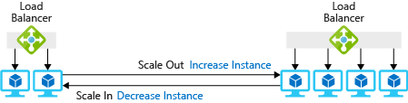

With **autoscale**, you no longer have to worry about scaling services manually. Instead, you can set a **minimum and maximum threshold of** instances. You can scale based on specific metrics like queue length or CPU utilization.

Usually, scalup out/horizontal provides:

- Higher availability
- Higher granularity in scaling
- Zero down-time as scaling occrus

**You need to consider this startup time when you determine how fast you want to scale.**

You can use autoscaling to add capacity. But you can also use a **throttling** mechanism to limit the number of requests from a source.
This way, you can **safeguard performance limits** by putting known limits into place at the application level. In this way, you prevent the application from breaking. Throttling is most frequently used in applications that expose API endpoints.

If any single customer exceeded this limit, you could respond with an **HTTP 429 status code** and include the wait time before another request can successfully be submitted.

### Scaling the server tier

Knowing your workload and picking the right type of VM is as essential as throwing more or larger VMs at the problem.

It is better to have five VMs handling compute-heavy workloads than 10, even if VMs optimized for CPU-intensive workloads cost 20% than more generic VMs.

### Scaling the data tier

In data-oriented applications, where there are a high number of reads and writes (or both) to a database or storage system, the round-trip time for each request is often limited by hard-disk read and write times. Larger instances allow for higher I/O performance, which can improve seek times on the hard disk and in turn reduce the latency of the service.

**Sharding**, or partitioning of the data across multiple resources, is another horizontal data-scaling strategy where instead of simply replicating the data across multiple instances, data is partitioned into segments and stored across multiple data servers.

An additional challenge when it comes to scaling the data tier is that of maintaining:

- **Consistency**: a read operation on all replicas is the same
- **Availability**: Reads and writes always succeed
- **Partition tolerance**: Guaranteed properties in the system are maintained when failures prevent communication across nodes

This is often referred to as the **CAP theorem**, which states that in a distributed database system, it is very difficult to obtain all three properties completely and thus may at most exhibit a combination of two of the properties1

### Design and implement distributed tracing

### Inspect application performance indicators

The easiest metrics for a dashboard graph to convey to interested parties in a few seconds' time, are singular, non-derivative, quantifiable measurements:

- **Requests per minute**: The volume of incoming requests or queries to a service over a given interval (often one second).
- **Response times**: Often expressed as medians, response times are the recorded time intervals between the delivery of requests to the server, and the receipt of responses from the server.
- **Idle connections**: The total number of network connections in which the server is awaiting requests from any client.Service availability - The percentage of a given interval when a service or application appeared to be responsive to requests.
- **CPU utilization**: Usually expressed as a percentage, this rate is a ratio comparing how much of a given interval of time the processor is active.
- **Error rate may mean different things to various platforms**: In software development, an error is a condition or behavior that isn't true to the intent of the instructions, and for which there isn't a plan. Some APM platforms track exception conditions (which are traceable events) and report their frequency over a given period as error rates, compounded with actual errors.
- **Garbage collector (GC) invocation**: This metric is especially important for a language interpreter such as Java, whose code uses data objects in memory, but then relies upon a "garbage collector" to free that memory when those objects are released.

Here are complex indicators:

- **Request Saturation Point**: Measuring utilization is relatively simple; measuring saturation has been a matter of some contention. An admin may think of this as the saturation point - a level beyond which wait times become unacceptable for clients. It may be possible for the admin to determine this saturation point after several observations of behavior patterns with negative outcomes. The correlation here in each case will be between the rate at which requests are received, as well as their rate of fulfillment.
- **Application Performance Index**: This index gives us three toleration zones on a scale between 0 and 100: "Satisfied," "Tolerating," and "Frustrated." The Apdex score for any given number of sample runs of one application is computed as the sum of the number of scores in the Satisfied zone and half the number of scores in the Tolerating zone, divided by the total number of samples.
- **Correlations**: Comparisons of two or more sets of metrics to each other.
- **The USE Method**: symbolize the most common correlation applied to evaluating the status of a solution.
  - *Utilization*: A level, often expressed as a percentage, representing the time over a given interval a resource is busy rather than idle.
  - *Saturation*: A level, often expressed as a percentage, representing the time over a given interval a resource is busy rather than idle.
  - *Errors*: The number of incidents of unhandled exceptions and unfulfilled requests during the same period.
- **The RED Method**:
  - *Rate*: The number of requests a service processes over a given interval (usually one second).
  - *Errors*: The number of failed requests in that same interval
  - *Duration*: The average time a service consumes in responding to a request before rendering a response

### Inspect infrastructure performance indicators

### Define and measure key metrics (CPU, memory, disk, network)

#### Multi-tenancy

Applications on public datacenters typically run on **shared infrastructure**.

#### Network Performance

Network performance can have a dramatic impact on a user's experience.

Latency is a measure of delay. Network latency is the time that it takes for data to travel between a source to a destination.
Calls between services in different physical locations will still have network latency directly correlated to the distance between them.

Depending on the communication needs of an application, more round trips might be required. Each round trip comes with a latency tax, and each round trip adds to the overall latency.

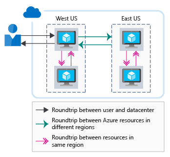

Apart from latency, applications may also have strict **bandwidth requirements**, particularly those that deal with rich multimedia content such as audio and video

##### Improve Network Performance

- Latency between users and Azure resources:
  - Use a DNS load balancer for endpoint path optimization
  - Use a CDN to cache content close to users
  - Use ExpressRoute for connectivity from on-premises to Azure

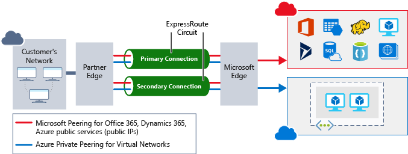

#### Storage Performance

Just like network latency, poor performance at the storage layer can affect your user experience.

When you build an infrastructure as a service (IaaS) workload, which type of disk should you use? There are four options:

- **Local SSD storage**: Each virtual machine has a temporary disk that's backed by local SSD storage.
- **Standard storage HDD** : This type of storage is spindle disk storage. It might fit well where your application **isn't bound by inconsistent latency or lower levels of throughput**.
- **Standard storage SSD**: This SSD-backed storage has the low latency of an SSD, but with **lower levels of throughput**.
- **Premium storage SSD**: his SSD-backed storage is well suited for those workloads that are going into production and require the greatest reliability, demand consistent low latency, or need **high levels of throughput and IOPS**.

Premium storage can attach only to specific VM sizes. Premium storage-capable sizes are designated with an **"s"** in the name.

#### Improve Storage Performance

##### Stripping

Disks can be **striped** by using a striping technology like Storage Spaces on Windows or mdadm on Linux.
Striping increases the **throughput** and **IOPS** by spreading disk activity across multiple disks.

##### Caching

A common approach to improve application performance is to integrate a **caching layer** between your application and your data store.
A cache typically stores data in memory and allows for fast retrieval. This data can be frequently accessed data, data that you specify from a database, or temporary data such as user state.

For instance, Azure Cache for Redis is a caching service on Azure that stores data in memory. It's based on the open-source Redis cache and is a fully managed service offering by Microsoft.

##### Polyglot persistence

Polyglot persistence is the use of **different data storage technologies** to handle your storage requirements.

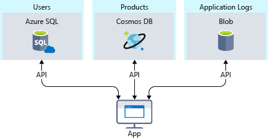

#### Application Performance

Before we talk about performance, it's important to talk about requirements, and **nonfunctional requirements** help you find that point.
Defining these requirements in advance of building your solution is critical.

#### Security Monitoring

##### Azure Security Center

Azure Security Center is a service that manages the security of your infrastructure from a centralized location. Use Security Center to monitor the security of your workloads, whether they're on-premises or in the cloud.

##### Azure Sentinel

You use Azure Sentinel to collect data on the devices, users, infrastructure, and applications across your enterprise. Built-in threat intelligence for detection and investigation can help reduce false positives. Use Sentinel to proactively hunt for threats and anomalies, and respond by using orchestration and automation.

#### Full Stack Monitoring

Full stack monitoring is a complete approach to the monitoring, triage, and diagnosis of application, infrastructure, and security issues that includes telemetry collection, tracking key performance indicators and the capability to isolate problems and perform root cause analysis.

### Remediation planning

**Remediation planning** is the process by which you define how problems uncovered by monitoring are mitigated and resolved.
Remediation can be:

- **responsive** in which case it is triggered by events surfaced by an APM.
- **proactive** in which case the goal is to continually make improvements to a system even in the absence of errors of other critical events.

#### Problem Ticketing

The work cycle of many IT departments revolves around **ticketing**.

Many organizations invest in a ticketing system that standardizes this process, often called **IT Operations Management (ITOM)**.

Ticketing is useful for applying as much automation as possible, and as much oversight as needed, to responding to problems in applications, the network, or in infrastructure as they occur.

#### Key Performance Indicators

The primary objective of a KPI is to make sure administrators are notified when something is wrong or is about to go wrong.

APM vendors often advise their customers to adopt a handful of **key performance indicators (KPI)**.

For enterprises that use it in performance monitoring, a KPI is a quantifiable value that represents some aspect of performance as it pertains to at least two of the following:

- **System health**
- **Relative progress in meeting business objectives**
- **End-user satisfaction with the system**
- **Efficiency of the IT department in resolving issues**

Business managers may expect a KPI to take into account factors outside of IT, including business-operations data. Here are some example KPIs applicable to performance monitoring:

- **Time consumed in entering data into a form**: Once transaction and query-processing times are eliminated, what remains is how much time individual users spend ascertaining the meaning of the form (or getting bored and going out for a cup of coffee first)
- **Percentage of catalog listings resulting in orders**, which reveals the effectiveness of an e-commerce system in selling its products and services
- **Mean Time to Detection (MTTD)**: The interval between the time that an error or other system issue occurred, and the time it was detected
- **Mean Time to Resolution (MTTR)**: The interval between the time an issue was detected and the time it was resolved
- **Percentage of system change completions blocked by other issues**: An indicator of how deeply performance issues can impact other services, and the extent to which larger, more comprehensive, projects to alleviate issues should be considered

#### Devising New KPIs

Some analysts have made the case that IT-centered APM tends to focus on metrics that are **separate from those from which true KPIs would be based**.

a process emerges for any organization to develop KPIs for its own internal use:

- **Gather disparate teams together**: No one team should be delegated the task of setting priorities and objectives without consulting the other teams.
- **Collectively set business priorities**: "Really fast Web page load times" is a perennial goal for information systems, but this will always be the case. What are the most pertinent goals of the organization, to which its information system plays a directly contributing role?
- **Quantify business objectives parameters**: Determine which of these priorities can be verifiably monitored and measured digitally.
- **Establish business targets**: Write the formulas for the relationships between measurable, observable factors, and the optimum values for those formulas, in a simple, mathematical way that all stakeholders can understand.
- **Integrate the ticketing system**: or whatever automated functions are involved in addressing problem issues, so that system improvement projects for business objectives purposes may co-exist with performance and software problems.
- **Dedicate the performance monitoring platform**: to the task of gathering the pertinent metrics that pertain to the established business targets. Where applicable, enable dashboards to continually report these metrics in simple, graphical forms.

#### Everyday Remediation

The basic tenet of modern remediation planning in IT is that the state of the organization's infrastructure, services, and applications may all be continually improved in a process known as **everyday remediation** or **continuous remediation**.

A number of principles follow from this tenet:

- **Nothing is "normal" anymore**: The goal for service levels becomes a moving target. In nature, this concept is called "evolution."
- **Massive upheavals can be avoided**: if small changes are being made all the time.
- **A working knowledge of the system is more deeply engrained** in the minds of everyone assigned to its upkeep. Many APMs enable their operators to take the basic reports of system events and "drill down" to their underlying causes and effects. If people understand these interdependencies better before they go hunting for root causes of failures, they'll have a better idea of both what to look for and where to look for it when failures occur.
- **The security team and the operations team should work together on a permanent basis** Performance issues are, at some level, security issues, especially to the extent that they can be exploited. A remediation approach to performance is like a resilience approach to security: Both are proactive as opposed to reactive, and both involve continual improvements to a solution.

### Implement alerts on key metrics (email, SMS, webhooks, Teams/Slack)

### Integrate user analytics (e.g., Application Insights funnels, Visual Studio App Center, TestFlight, Google Analytics)

#### Application Insights Funnels

Understanding the customer experience is of the utmost importance to your business.
The progression through a series of steps in a web application is known as a **funnel**. You can use Azure Application Insights Funnels to gain insights into your users, and monitor step-by-step conversion rates.

Before you create your funnel, **decide on the question you want to answer**

#### Application Insights's User Behavior Analytics

##### User Flow

The User Flows tool visualizes how users navigate between the pages and features of your site. It's great for answering questions like:

- How do users navigate away from a page on your site?
- What do users click on a page on your site?
- Where are the places that users churn most from your site?
- Are there places where users repeat the same action over and over?

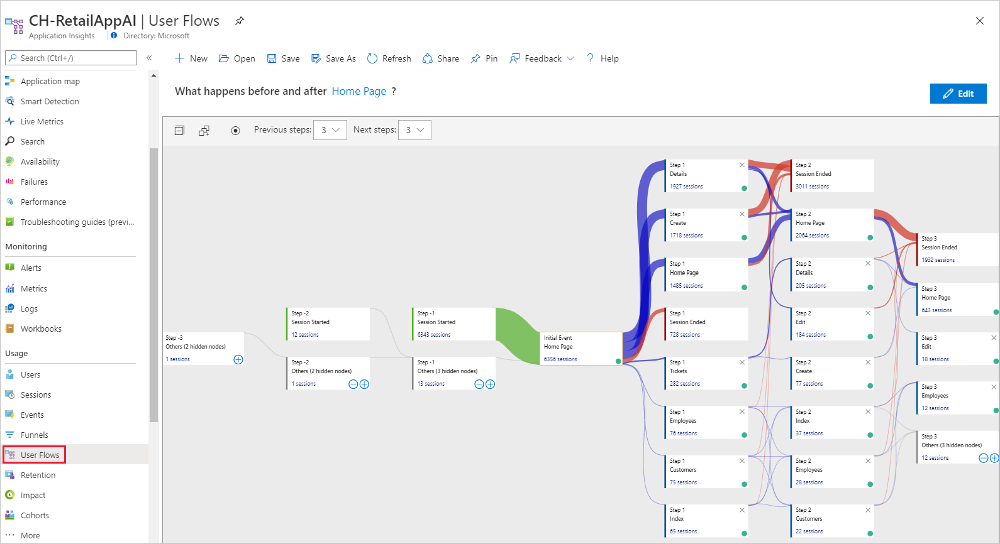

## Integrate logging and monitoring solutions

### Introduction

Monitoring is the act of collecting and analyzing data to determine the performance, health, and availability of your business applications, and the resources on which they depend.

Monitoring is as important in mission-critical solutions deployed to the cloud as the solutions themselves. In a fully monitored data-center environment, instrumentation is provided by software. Instrumentation generally takes on the three forms:

- **Logs**: Permanent, immutable records of events stored in a consistent, tabular format, if not in a full database.
- **Metrics**: Values that represent the relative health, stability, and availability of a service or application or the infrastructure that hosts it
- **Traces**: Records of the paths of execution for programs and services, especially in a highly distributed system, indicating the sequence of instructions that may have triggered, either directly or indirectly, an event

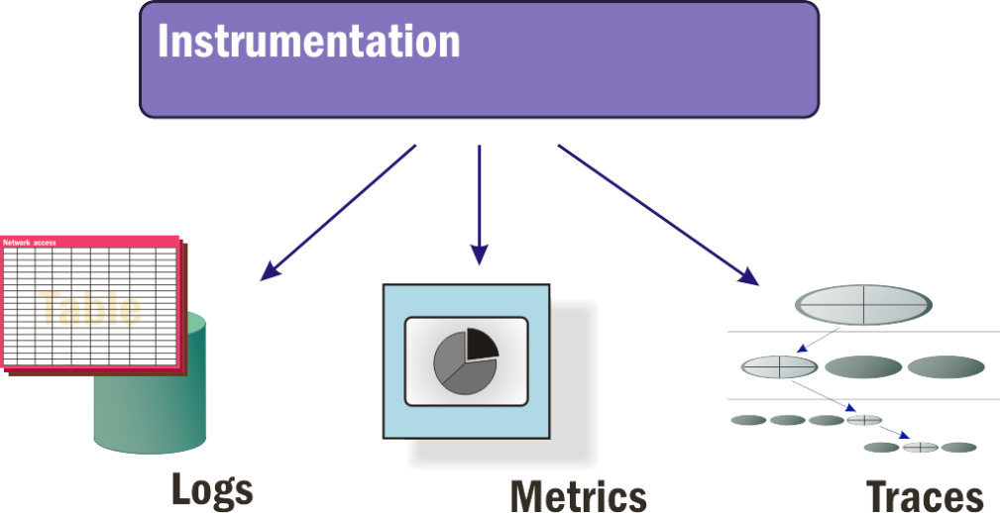

#### Logs

A log-monitoring or log-management (LM) platform provides access to the messages being recorded by services, applications, and infrastructure components in an information system.

The more sophisticated log-management platforms leverage **streaming message queues** such as Apache Kafka, which can distribute messages through a network extremely efficiently.

An log-management platform used by IT administrators and personnel for performance monitoring should be capable of performing the following tasks:

- **Correlation**: Joining relevant recorded events together into a single view so that managers are not forced to scan raw data for potentially pertinent information

- **Normalization**: Reducing the volume of recorded data in the database, as well as in administrators' views of the database, into more manageable volumes

- **Reporting**: Presenting a graphical, informational view of events that is intelligible to someone working outside the realm of day-to-day IT operations

#### Metrics

Typically, a log records events over time while metrics represent states of being or service levels, often at the present time.

Common categories of low-level, IT-related metrics tracked by an APM platform include:

- **Request queue volume**: A measure of the backlog of incoming user requests, compared to the system's ability to respond to them
- **User sentiment**: Estimates based on the relative level of productive workflow compared to the activity level of a user
- **Resource availability**: The responsiveness of system resources to requests or queries
- **Error rates**: The relative volume of behavioral events that cannot be mitigated by the application, or by the server's infrastructure
- **Session length**: The intervals of time between users logging on and logging off

#### Traces

Trace-maintenance platforms represent a category of performance-management tool that collect data about the low-level service calls between highly distributed services and functions, especially in containerized environments orchestrated by Kubernetes.

### Azure Areas

When it comes to monitoring and analytics on Azure, we can bundle services into three specific areas of focus:

- **Core monitoring**: provides fundamental, required monitoring across Azure resources.
  - *Activity logging*: information about what is happening with your resources at the Azure platform level. Every change that is submitted to the Azure platform is tracked in the Azure Activity Log
  - *Health of cloud services*: Azure Service Health identifies any issues with Azure services that might affect your application. Service Health also helps you plan for scheduled maintenance.
  - *Metrics and diagnostics*: Azure Monitor enables core monitoring for Azure services by allowing the collection, aggregation, and visualization of metrics, activity logs, and diagnostic logs.
  - *Recommendations on best practices*: Azure Advisor can help by keeping an eye out for potential performance, cost, high availability, or security issues within your resources.

- **Deep infrastructure monitoring**: When you're designing a monitoring strategy, it's important to include every component in the application chain, so you can correlate events across services and resources.
  - With this data in Log Analytics, you can query the raw data for troubleshooting, root cause identification, and auditing purposes.

- **Deep application monitoring**: Take your monitoring capabilities even further by looking deep into your applications to identify performance issues, usage trends, and the overall availability of services you develop and depend on.
  - By using an application performance management tool, you can better detect and diagnose issues that occur within your web apps and services.

#### Azure Monitor

Azure Monitor provides a single management point for infrastructure-level logs and monitoring for most of your Azure services.

Azure Monitor collects data from each of the following tiers:

- **Application monitoring data**: Data about the performance and functionality of the **code you've written**, regardless of its platform.
- **Guest OS monitoring data**: Data about the **OS on which your application is running**. This OS might be in Azure, another cloud, or on-premises.
- **Azure resource monitoring data**: Data about the **operation of an Azure resource**.
- **Azure subscription monitoring data**: Data about the **operation and management of an Azure subscription**, and data about the health and operation of Azure itself.
- **Azure tenant monitoring data**: Data about the operation of **tenant-level Azure services**, such as Azure Active Directory (Azure AD).

You can extend the data that Azure Monitor collects by:

- **Enabling diagnostics**: For some resources, such as Azure SQL Database, you receive full information about a resource only after you have enabled diagnostic logging for it. You can use the Azure portal, the Azure CLI, or PowerShell to enable diagnostics.
- **Adding an agent**: For virtual machines, you can install the Log Analytics agent and configure it to send data to a Log Analytics workspace. This agent increases the amount of information that's sent to Azure Monitor.

##### VM Insights

VM insights monitors the performance and health of your virtual machines and virtual machine scale sets, including their running processes and dependencies on other resources.

VM insights supports Windows and Linux operating systems on the following machines:

- Azure virtual machines
- Azure virtual machine scale sets
- Hybrid virtual machines connected with Azure Arc
- On-premises virtual machines
- Virtual machines hosted in another cloud environment

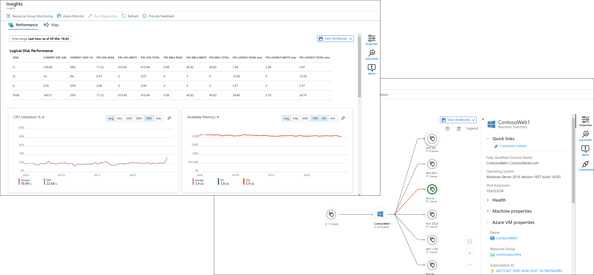

##### Log Analytics

Centralized logging can help you uncover hidden issues that might be difficult to track down. With Log Analytics, you can query and aggregate data across logs

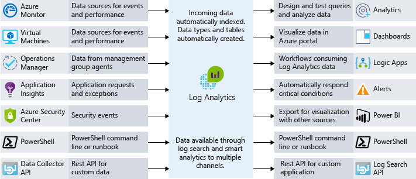

For custom logs and metrics, you can use the HTTP Data Collector API to write data to Log Analytics from any REST API client or an Azure Logic App to write data from a custom workflow.

#### Application performance management

Deep application issues are often tricky to track down. This type of scenario is when it can be beneficial to integrate telemetry into your application by using an **application performance management (APM) solution**.

Telemetry can include individual page request times, exceptions within your application, and even custom metrics to track business logic.

Application Insights is an Azure service that provides this deep application performance management.

You can use Application Insights to consume telemetry from the host environments, such as performance counters, Azure diagnostics, and Docker logs.

An APM solution can help you understand how a specific action works in the client browser, on the server, and through to downstream services.

There are two ways to configure your app to send data to Application Insights:

- **Runtime instrumentation**: Runtime instrumentation captures telemetry without requiring you to change the web app's source code.
- **Build-time instrumentation**: With this method, developers add a server-side SDK to the web app's code.

You can enable **client-side instrumentation** for an app by including a standard Application Insights JavaScript library in pages delivered to your app's users.

>*Note that runtime instrumentation and automatic client-side instrumentation is supported only on Windows web apps.*

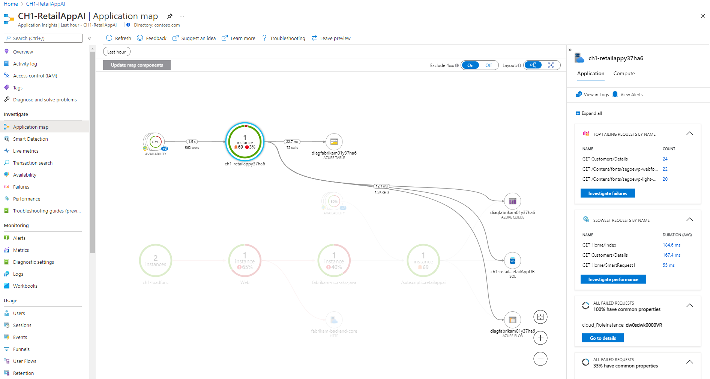

##### Availability Tests

You can create availability tests to monitor the health of your applications continuously. Availability tests allow you to check the health of your application from different geographic locations.

##### SDK

The Application Insights SDK is a software package you reference and use in your application's code.
The SDK sends this telemetry data to an Application Insights resource in Azure. The Application Insights service processes and aggregates the data into a form that's easy to query and visualize.

The Application Insights SDK provides these benefits:

- **Comprehensive data collection**: Data like user retention, unique users, and unique sessions is available in Application Insights only when you use the Application Insights SDK.
- **Custom telemetry**: With the SDK, you can add code to your application to capture events and metrics that are specific to your app and its business domain.
- **Advanced features**: Some Application Insights features are available only when you use the SDK. For example, Live Metrics Stream lets you watch and drill down into metrics in real time.
- **Local telemetry in Visual Studio**: Telemetry data from applications instrumented with the SDK can be viewed locally in Visual Studio when you run the app in the debugger.

Azure App Service lets you enable Application Insights for an application without adding the SDK to your code. This feature, called runtime instrumentation, **doesn't offer deep insight into your app the way the SDK can**.

When you configure and initialize the SDK in your code, it tracks the kinds of events and metrics that are common to all web applications, like request and response metrics, HTTP queue lengths, and performance counters like CPU and memory utilization.

**Events** and **metrics** are the two primary types of custom data that can be tracked by Application Insights.

Events represent any kind of event that occurs in your application that you're interested in tracking.
Metrics are numeric measurements taken independently of any event, typically on an interval. Metrics are **pre-aggregated**. Application Insights stores and transmits a statistical summary of measurements taken over time, not the exact value of each measurement.

Metrics can also be **multidimensional**. Multidimensional metrics record multiple values into a single metric. These properties can be used to segment, filter, and group the data in visualizations.

### Configure and integrate container monitoring (Azure Monitor, Prometheus, etc.)

#### Tracing in Microservices Environments

With microservices, the code modules of an application become applications unto themselves, which interact with and pass control between one another through the network. To find one another, they may use raw IP addresses, but more likely they use a DNS server for service discovery, or they might make use of a **service mesh** to discover each other's identities and locations.

Consequently, specialized APM platforms are available for monitoring microservice-based solutions.

#### Azure Monitor Container Insights

Container insights delivers a comprehensive monitoring experience using different features of Azure Monitor.

Container insights is a feature designed to monitor the performance of container workloads deployed to:

- Managed Kubernetes clusters hosted on Azure Kubernetes Service (AKS)
- Self-managed Kubernetes clusters hosted on Azure using AKS Engine
- Azure Container Instances
- Self-managed Kubernetes clusters hosted on Azure Stack or on-premises
- Azure Red Hat OpenShift
- Azure Arc enabled Kubernetes (preview)

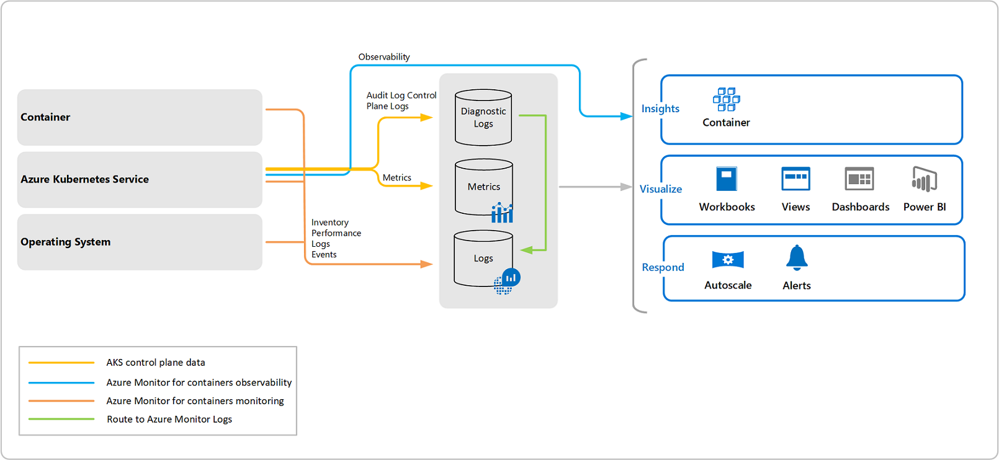

#### Prometheus

One of the first monitoring tools to address the requirements of a microservices environment was Prometheus.
Prometheus uses a **time series database**

Prometheus is now marshaled by the Cloud Native Computing Foundation, the home of Kubernetes.

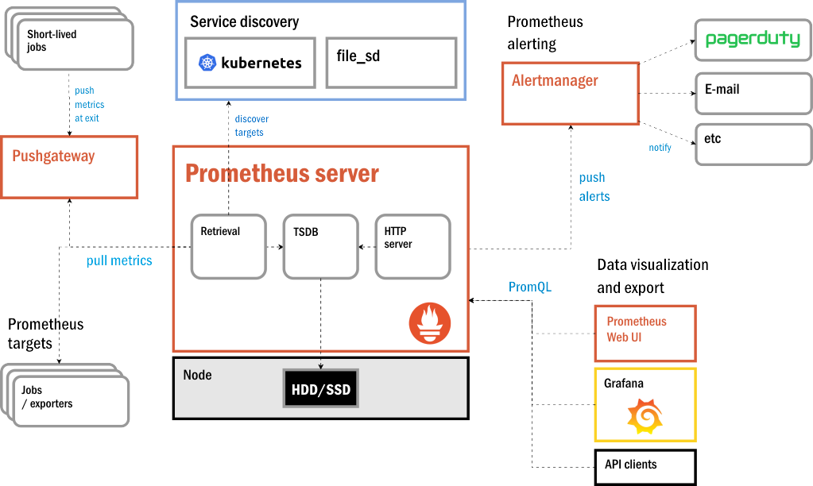

### Configure and integrate with monitoring tools (Azure Monitor Application Insights, Dynatrace, New Relic, Naggios, Zabbix)

#### Application Insights

Application Insights is represented in Azure as a resource deployed to one of your subscriptions.

To send telemetry data to an Application Insights resource from an app, you need to configure the app with the **instrumentation key** of the Application Insights resource.

##### Visualizations

By viewing an Application Insights resource in the Azure portal, you can visualize the telemetry captured from your app in a variety of ways.

- **Live metrics streams**: Charts that display performance values as they vary in near-real time.
- **Metrics explorer**: Tool that shows how metrics vary over time.
- **Alerts**: Messages automatically sent to app admins when target metrics exceed specified thresholds. You can use alerts to ensure your team is aware of critical issues immediately.
- **Profiler**: Shows how a set of requests, like those for a single web page, were delivered. You can use these profiles, for example, to see which page elements load slowly.
- **Application Map**: Displays the components of an application and how they link to each other. You can use the data shown with each component to diagnose performance bottlenecks and failure hotspots.
- **Usage analysis**: Information about your app's users. For example, you can see numbers of unique users and sessions and information about user retention.

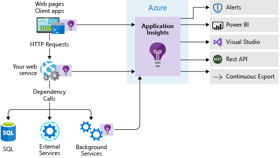

#### New Relic

The New Relic monitoring platform, now dubbed New Relic One, is one of many agent-based monitoring tools available on the market.

This platform utilizes the following classes of agents:

- **APM agent**: Gathers relevant data concerning the performance of a specific application. It may be installed alongside the application itself as a separate component and contacted via API.
- **Mobile agent**: A variant of the APM agent optimized for deployment on Android and iOS devices.
- **Browser agent**: A segment or "snippet" of JavaScript code attached to a Web page by way of an HTML tag.
- **Infrastructure agent**: Installed on a remote machine, or on the home server itself (either of which may be a VM) so that it's launched at startup.

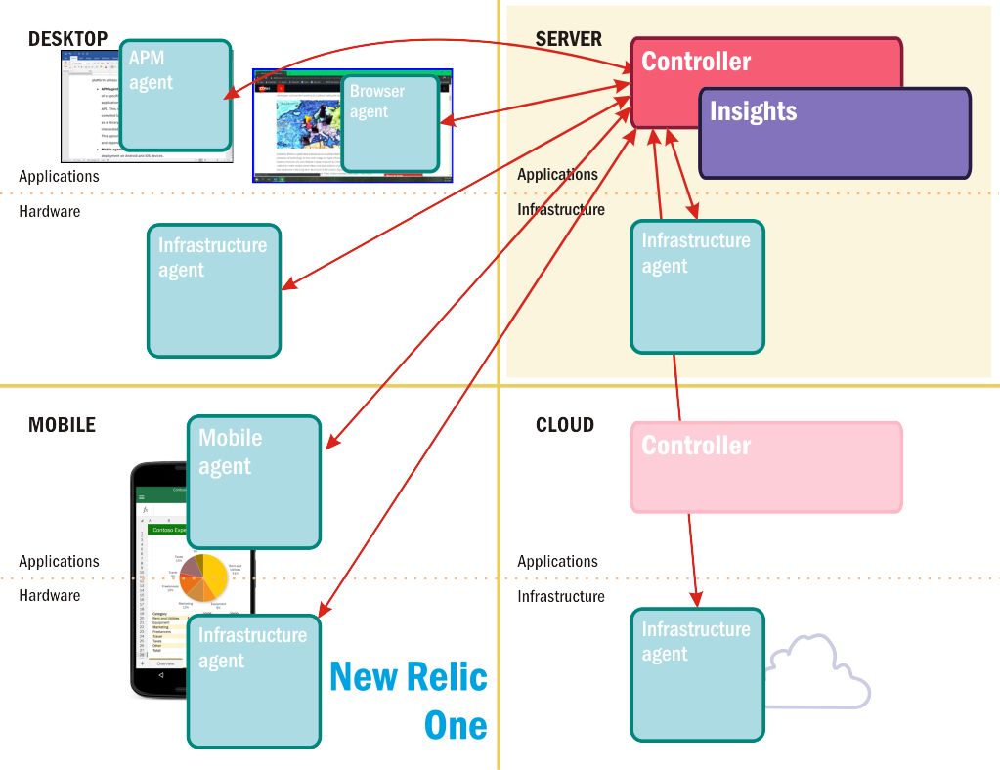

Insights is New Relic's brand for the component that analyzes collected data, generates reports and alerts, and projects dashboards.

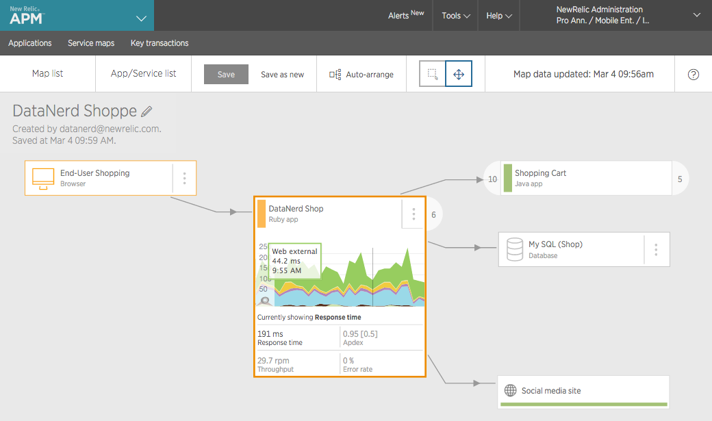

#### Agentless Monitoring Platforms

The typical agentless monitoring tool or platform relies on the current state of a server, including the system services that support its hardware, to provide the information the platform needs to ascertain its operating status, and to determine whether an event regarding that status should be actionable.

For a log to be certified by standards organizations as auditable - providing the necessary information for a thorough analysis of an operation - each of its records must include the following:

- The identity and/or type of each activity performed that is relevant to the category of the log
- The identity of the owner of that activity, or the authenticated source responsible for launching it
- The names of components or objects in the environment affected by the activity
- The time in which the activity took place
- The result of the activity (what changed, if anything)

#### Sumo Logic

Sumo Logic is one example of an agentless monitoring platform. It is based on a concept it calls **machine data analytics**, which is centered on log management.

With common services such as Apache Web Server, Sumo Logic already knows what factors to look for and can generate a suitable dashboard in just a few seconds.

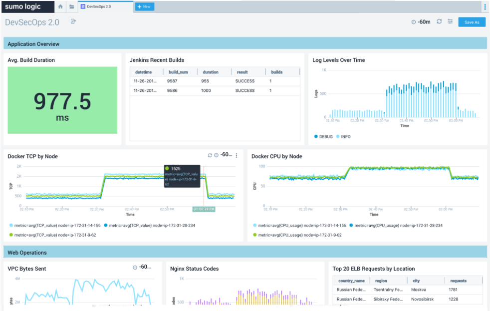

### Create feedback loop from platform monitoring tools (e.g., Azure Diagnostics extension, Log Analytics agent, Azure Platform Logs, Event Grid)

#### Azure Event Grid

Event Grid aggregates all your events and provides routing from any source to any destination.
Event Grid is a service that manages the routing and delivery of events from many sources and subscribers.

##### Concepts

- **Events**: What happened.
- **Event sources**: Where the event took place.
- **Topics**: The endpoint where publishers send events.
- **Event subscriptions**: The endpoint or built-in mechanism to route events, sometimes to more than one handler.Subscriptions are also used by handlers to intelligently filter incoming events.
- **Event handlers**: The app or service reacting to the event.

##### Capabilities

Here are some of the key features of Azure Event Grid:

- **Simplicity**: Point and click to aim events from your Azure resource to any event handler or endpoint.
- **Advanced filtering**: Filter on event type or event publish path to make sure event handlers only receive relevant events.
- **Fan-out**: Subscribe several endpoints to the same event to send copies of the event to as many places as needed.
- **Reliability**: 24-hour retry with exponential backoff to make sure events are delivered.
- **Pay-per-event**: Pay only for the amount you use Event Grid.
- **High throughput**: Build high-volume workloads on Event Grid.
- **Built-in Events**: Get up and running quickly with resource-defined built-in events.
- **Custom Events**: Use Event Grid to route, filter, and reliably deliver custom events in your app.

### Manage Access control to the monitoring platform

### Resource Groups

Resource groups are a fundamental element of the Azure platform. A resource group is a logical container for resources deployed on Azure.µ

Note that:

- Regarding **Logical grouping**, resource groups exist to help manage and organize your Azure resources.
- Regarding **Life cycle**, If you delete a resource group, all resources contained within are also deleted. Organizing resources by life cycle can be useful in non-production environments, where you might try an experiment, but then dispose of it when done.
- Regarding **Authorization**, resource groups are also a scope for applying role-based access control (RBAC) permissions.

So how can you use resource groups to your advantage in your new organization? There are some guidelines and best practices that can help with the organization.

- **Consistent naming convention**: You can start with using an understandable naming convention.
- **Organizing principles**

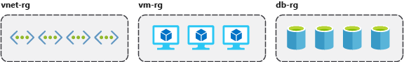

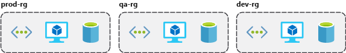

- **Organizing for authorization**
- **Organizing for life cycle**
- **Organizing for billing**

### Tagging

Tags are name/value pairs of text data that you can apply to resources and resource groups. Tags allow you to associate custom details about your resource, in addition to the standard Azure properties a resource has the following properties:

- department (like finance, marketing, and more)
- environment (prod, test, dev)
- cost center
- life cycle and automation (like shutdown and startup of virtual machines)

A resource can have up to **50 tags**. The name is limited to 512 characters for all types of resources except storage accounts, which have a limit of 128 characters.
>*Note that not all Azure resouces support tagging*

### Policies

Azure Policy is a service you can use to create, assign, and manage policies. These policies apply and enforce rules that your resources need to follow.

### RBAC

RBAC provides fine-grained access management for Azure resources, enabling you to grant users the specific rights they need to perform their jobs. RBAC is considered a core service and is included with all subscription levels at no cost.

RBAC uses an **allow model** for access. When you are assigned to a role, RBAC allows you to perform specific actions, such as read, write, or delete.

### Resource Locks

Resource locks are a setting that can be applied to any resource to block modification or deletion. Resource locks can set to either **Delete** or **Read-only**. **Delete** will allow all operations against the resource but block the ability to delete it. **Read-only** will only allow read activities to be performed against it, blocking any modification or deletion of the resource.
> *Applying Read-only can lead to unexpected results because some operations that seem like read operations actually require additional actions.*
