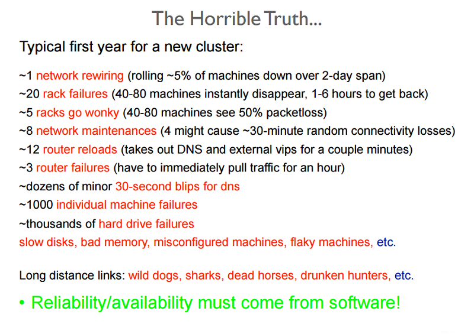
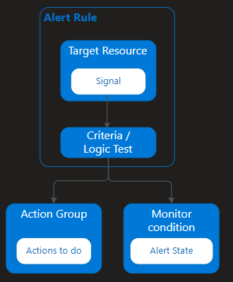
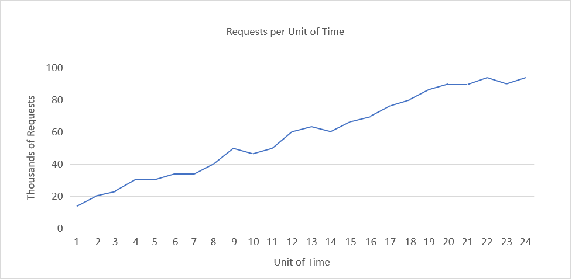
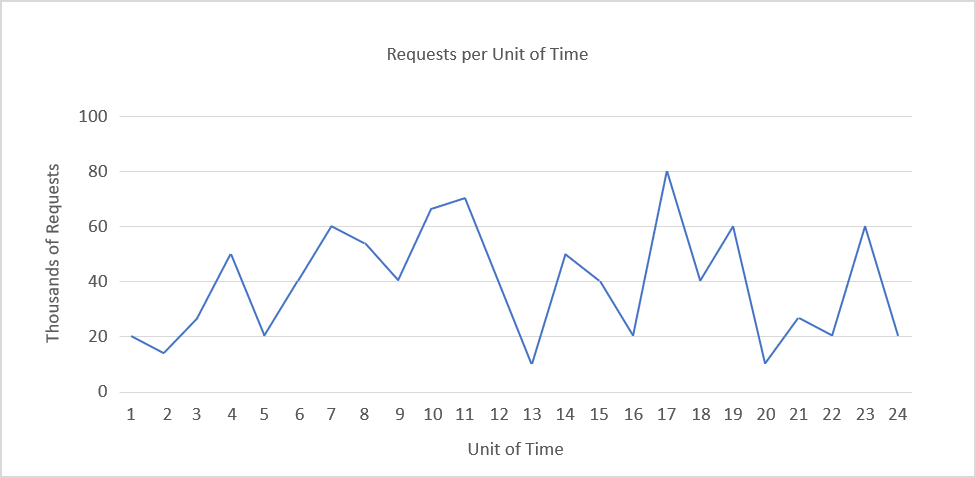
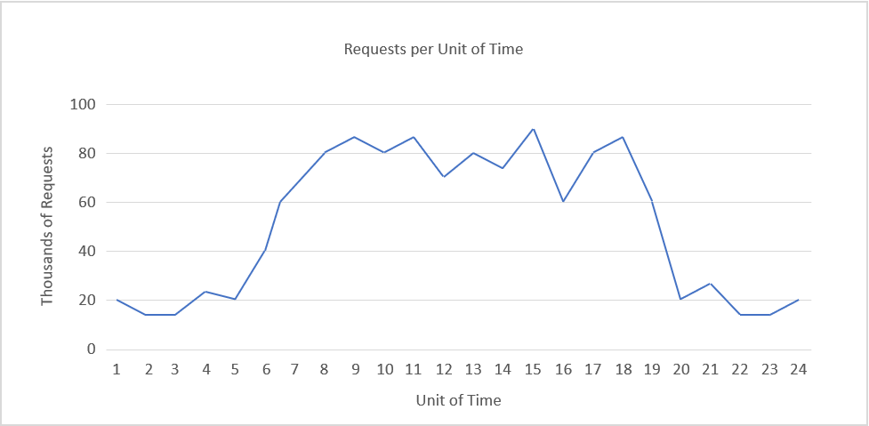
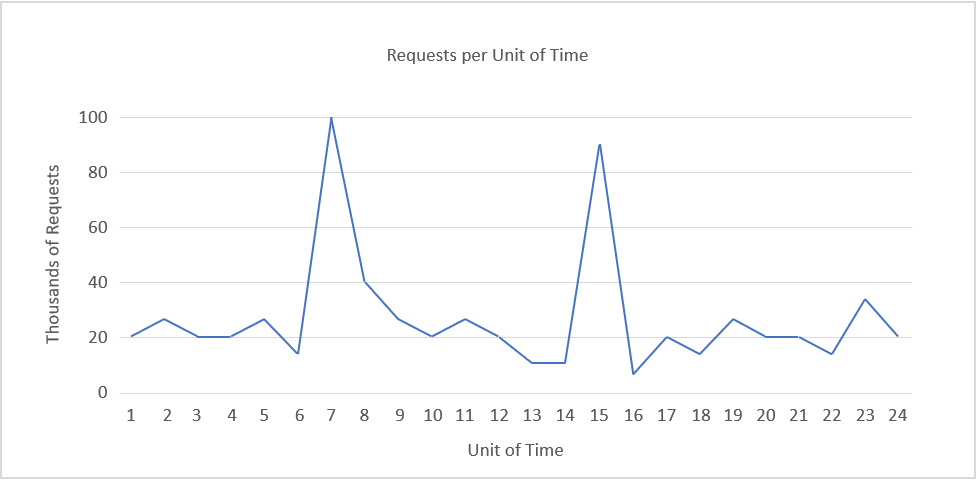

## Introduction to Site Reliability Engineering

Site Reliability Engineering is an engineering discipline devoted to helping an organization sustainably achieve the appropriate level of reliability in their systems, services, and products.

### Reliability

An important observation made by the SRE world is there are very few systems and services that have to be 100% reliable. Life and death situations like aviation, medical devices, etc. are a notable exception.

The goal of is to achieve the appropriate level of reliability in your system, services, and products.

Systems typically develop faults of one of the following types:

- **Transient faults**: Temporary faults in the system that correct themselves with time.
- **Permanent faults**: Faults that cannot be recovered from and generally require replacement of resources.
- **Intermittent faults**: Faults that occur periodically in a system.

#### Proactive measures

Service providers take several measures in order to design the system in a specific way to avoid known issues, or predictable failures.

- **Profiling and testing**: Load and stress testing cloud resources in order to understand possible causes of failure is essential to ensure the availability of services.
- **Over-provisioning**: The practice of deploying resources in volumes that are larger than the general projected utilization of the resources at a given time. Over-provisioning is also a tactic used to defend against DoS (denial of service) or DDoS (distributed DoS) attacks
- **Replication**: Critical system components can be duplicated by using additional hardware and software components to silently handle failures in parts of the system without the entire system failing.
  - *Active replication*: where all replicated resources are alive concurrently and respond to and process all requests.
  - *Passive replication*: where only the primary unit processes requests, and secondary units merely maintain state and take over once the primary unit fails.
  There is also a hybrid strategy, called semi-active, which is very similar to the active strategy

#### Reactive measures

- **Checks and monitoring**: There are several monitoring tactics that are used to check crash faults within a system. Two of these tactics are:
  - **Ping-echo**: The monitoring service asks each resource for its state and is given a time window to respond.
  - **Heartbeat**: Each instance sends status to the monitoring service at regular intervals, without any trigger.
- **Checkpoint and restart**: Several programming models in the cloud implement checkpoint strategies, whereby state is saved at several stages of execution in order to enable recovery to a last-saved checkpoint.

#### Case studies in resiliency testing

Testing for failures with real traffic needs to be done regularly so that the system is hardened and can cope when an unplanned outage occurs. There are various systems built to test resiliency.
One such testing suite is **Simian Army** built by Netflix.

Simian Army consists of services (referred to as **monkeys**) in the cloud for generating various kinds of failures, detecting abnormal conditions, and testing the system's ability to survive them.

Some of the monkeys found in Simian Army are:

- **Chaos monkey**: A tool that randomly picks a production instance and disables it to make sure the cloud survives common types of failure without any customer impact.
- **Latency monkey**: A service that induces delays in between RESTful communication of different clients and servers, simulating service degradation and downtime.
- **Doctor monkey**: A service that finds instances that are exhibiting unhealthy behaviors (for example, CPU load) and removes them from service.
- **Chaos gorilla**: A service that can simulate the loss of an entire AWS availability zone.

### Sustainably achieve

The final word from our definition that we need to highlight before we move on is sustainably. Sustainably refers to the role of people in all of this. It is crucial we create a sustainable operations practice.

### History

A highly condensed history of SRE begins with its origins at Google in 2003. Ben Treynor, now Treynor Sloss, took over leadership of Google’s “Production Team” (then only seven software engineers) and created the idea he famously described as “what happens when you ask a software engineer to design an operations function.”

SRE was started with software engineering mindset.

### SRE vs DevOps

How SRE and DevOps differ is a topic still under considerable discussion in the field. There are some broadly agreed upon differences, including:

- SRE is an engineering discipline that focuses on **reliability**, DevOps is a cultural movement that emerged from the urge to **break down the silos** typically associated with separate Development and Operations organizations.
- SRE can be the name of a role as in "I’m a site reliability engineer (SRE)", DevOps can't. No one, strictly speaking, is a "DevOps" for a living.
- SRE tends to be more prescriptive, DevOps is intentionally not so. Nearly universal adoption of continuous integration/continuous delivery and Agile principles are the closest it comes in this regard.

The two operations practices, DevOps and SRE, share a mutual love of monitoring/observability and automation (perhaps for different reasons).
> *It is important to note that DevOps and SRE are two different parallel attempts to address the same challenges. SRE is not the next evolutionary step after DevOps. SRE was not created to be "the future of DevOps."*

### Key SRE principles : Virtuous cycle

#### Virtuous cycle #1: SLIs and SLOs

The first decision that gets made is what will be used as indicators of the service’s health **(a Service Level Indicator or SLI)**.

Now that we have a clear indicator for how to tell how the service is doing, we’re going to want to decide what level of reliability we expect or desire from it. That expectation, created in collaboration with the service’s developer, is a **Service Level Objective (SLO)**.

##### Error budgets

It can be straightforward to understand that an organization might snap into action if a service doesn’t meet its SLO, but SRE takes this whole concept another step forward for the cases where the SLO is being met or exceeded. **Some organizations use SLOs to construct what they call “error budgets”.**

#### Virtuous cycle #2: blameless postmortems

One thing that is closer to being distinctive is SRE’s insistence that postmortems need to be **“blameless.”**

The tenor and direction of these questions is crucial. They are searching for ways to improve the systems or processes, not ways to punish the individuals whose use of those systems or processes in good faith contributed to the outage.

### Key SRE principles : The human side of SRE

#### Toil

In an SRE context, **toil** refers to **operations work being done by a human that has certain characteristics**.

For example, if a service requires the SRE team to reset something every week, or to provision new accounts and disk space by hand, or repeatedly restart it by hand this is operational load that is toil. Completing those actions hasn’t made the service better in any long-term, persistent way. These actions will likely have to be repeated over and over.

**SREs hate toil.** This is one of the places automation comes into play in SRE. If these requests can be handled automatically, that frees up the team to work on more rewarding and impactful things than draining the request queue.

SREs work to eliminate toil wherever and whenever it is appropriate

#### Project work vs. reactive "ops" work

To do the work necessary to remove toil, or improve the reliability of a system, an SRE’s time has to be allocated in such a way that they aren’t spending all of their time firefighting, replying to pages, or just processing a ticket queue. They need to have the time set aside to write code to eliminate the toil

*The figure usually cited (which comes from the original Google model) is one of no more than 50% operational load on a team.*

## Develop an actionable alerting strategy

### Introduction

#### Monitoring and alerting

Monitoring and alerting enables a system to tell people when it's broken, or perhaps to tell them what's about to break.

When you review existing alerts or write new alert rules, consider these guidelines to keep your alerts relevant and your on-call rotation happier:

- Alerts that trigger a human's attention should be **urgent, important, action-oriented, and real**.
- Alerts should **represent either ongoing or imminent problems** with your service.
- Remove noisy alerts. Over-monitoring is a harder problem to solve than under-monitoring.
- Classify the problem into one of these categories:
  - Availability and basic functionality.
  - Latency.
  - Correctness.
  - Feature-specific problems.
- Symptoms are a better way to capture problems comprehensively and robustly with less effort.
- Include cause-based information in symptom-based pages or on dashboards but avoid alerting directly on causes.
- The further up your serving stack you go, the more distinct problems you catch in a single rule. But don't go so far that you can't sufficiently distinguish what's going on.
- If you want a quiet on-call rotation, have a system for dealing with issues that need a timely response but are not imminently critical.

#### Monitor for your users

Monitoring for your users is also called **symptom-based monitoring**. This is in contrast to **cause-based monitoring**

In general, users care about:

- **Basic availability and correctness**: Anything that breaks the core service in some way should be categorized as unavailability.
- **Latency**: Pages should load quickly.
- **Completeness, freshness, and durability**: Your users' data should be safe, should come back promptly, and search indices should be up to date.
- **Uptime**: Even if the service is temporarily unavailable, users should have complete faith that the service will be back up soon.
- **Features**: Your users care that all the features of the service work. Monitor for anything that is an important aspect of your service, even if it's not core functionality.

#### Cause-based alerts have their place

Sometimes there is no symptom to alert on but you still need to be alerted to a situation.

### Identify and recommend metrics on which to base alerts

Azure Monitor receives data from target resources like applications, operating systems, Azure resources, Azure subscriptions, and Azure tenants.

You'll learn about the three signal types that you can use to monitor your environment:

- **Metric** alerts provide an alert trigger when a specified threshold is exceeded. For example, a metric alert can notify you when CPU usage is greater than 95 percent.
- **Activity log** alerts notify you when Azure resources change state. For example, an activity log alert can notify you when a resource is deleted.
- **Log** alerts are based on things written to log files. For example, a log alert can notify you when a web server has returned a number of 404 or 500 responses.

#### Composition of an alert rule

Every alert or notification available in Azure Monitor is the product of a rule.
No matter which target resource or data source you use, the composition of an alert rule remains the same.

- **RESOURCE**
  - The *target resource* to be used for the alert rule. It's possible to assign multiple target resources to a single alert rule.
- **CONDITION**
  - The *signal type* to be used to assess the rule. The signal type can be a metric, an activity log, or logs. There are others, but this module doesn't cover them.
  - The *alert logic* applied to the data that's supplied via the signal type. The structure of the alert logic will change depending on the signal type.
- **ACTIONS**
  - The *action*, like sending an email, sending an SMS message, or using a webhook.
  - An *action group*, which typically contains a unique set of recipients for the action.
- **ALERT DETAILS**
  - An *alert name* and an alert description that should specify the alert's purpose.
  - The *severity* of the alert if the criteria or logic test evaluates true. The five severity levels are:
    - *0*: Critical
    - *1*: Error
    - *2*: Warning
    - *3*: Informational
    - *4*: Verbose

#### Scope of alert rules

you can create alert rules for these items and more:

- Metric values
- Log search queries
- Activity log events
- Health of the underlying Azure platform
- Tests for website availability

The following alert capabilities aren't yet available for the generation of monitoring data:

- Service health alerts based on activity logs
- Web availability tests through Application Insights

#### Manage alert rules

With Azure Monitor, you can specify one or more alert rules, and enable or disable them, as needed.

#### Alert summary view

By default, the alert page shows a summary of all alerts.
However, the following constraints apply:

- **Subscriptions**: You're limited to reporting on a maximum of five subscriptions.
- **Resource groups**: You can have only one resource group.
- **Time ranges**: These ranges support the past hour, the past 24 hours, the past 7 days, and the past 30 days.

#### Alert State

Currently, there are three states:

- Every new alert has an alert state of **New**. This state means that the issue has been detected, but not yet reviewed.
- After an admin has reviewed the alert, and is working on it, the alert state changes to **Acknowledged**.
- When the issue is resolved, the alert state is set to **Closed**.

#### Filter alerts

You can select the following items to filter the view:

- **Smart groups**: You can select this filter if it's enabled.
- **Resource type**: Applies only when it's used with a resource group.
- **Resource**: Applies only when a resource type has been specified.
- **Severity**: Identifies the severity assigned by the alert rule.
- **Monitor condition**: Set by the system and indicates if the alert is fired or resolved.
- **Alert state**: Typically, finds the New and Acknowledged alerts.

### Implement alerts using appropriate metrics

#### Composition of a metric alert

You must define the type of statistical analysis to be used with either **static** or **dynamic** metric alerts.
Example types are minimum, maximum, average, and total.

##### Use static threshold metric alerts

With static metrics, you specify the threshold that will be used to trigger the alert or notification.

##### Use dynamic threshold metric alerts

Dynamic metric alerts use machine learning tools that Azure provides to automatically improve the accuracy of the thresholds defined by the initial rule.

There's no hard threshold in dynamic metrics. However, you'll need to define two more parameters:

- The **look-back period** defines how many previous periods need to be evaluated.
- The **number of violations** expresses how many times the logic condition has to deviate from the expected behavior before the alert rule fires a notification.

#### Understand dimensions

Azure Monitor supports dimensions, which enable monitoring data to be supplied from multiple target instances.
You use dimensions to define one metric alert rule, and have it applied to multiple related instances.

Azure Monitor supports the creation of metric alerts that, like dimensions, monitor multiple resources. Scaling is currently limited to Azure virtual machines.

### Implement alerts based on appropriate log messages

Log alerts use log data to assess the rule logic and, if necessary, trigger an alert. This data can come from any Azure resource: server logs, application server logs, or application logs.

#### Composition of log search rules

Every log alert has an associated search rule. The composition of these rules is:

- **Log query**: Query that runs every time the alert rule fires.
- **Time period**: Time range for the query.
- **Frequency**: How often the query should run.
- **Threshold**: Trigger point for an alert to be created.

Log search results are one of two types:

- **Number of records**: This type of log search returns a single alert when the number of records in a search result reaches or exceeds the value for the number of records (threshold).
- **Metric measurement**: Unlike number-of-records search logs, metric measurement logs require additional criteria to be set:
  - *Aggregate function*: The calculation that will be made against the result data.
  - *Group field*: A field by which the result will be grouped.
  - *Interval*: The time interval by which data is aggregated.
  - *Threshold*: A point defined by an aggregated value and the total number of breaches.

### Implement alerts based on application health checks

Activity log alerts enable you to be notified when a specific event happens on some Azure resource. For example, you can be notified when someone creates a new VM in a subscription.

An activity log can also include alerts for **Azure service health**. A company can be notified when service issues or planned maintenance happens on the Azure platform.

There are two types of activity log alerts:

- **Specific operations**: Apply to resources within your Azure subscription, and often have a scope with specific resources or a resource group. You use this type when you need to receive an alert that reports a change to an aspect of your subscription. For example, you can receive an alert if a VM is deleted or new roles are assigned to a user.
- **Service health events**: Include notice of incidents and maintenance of target resources.

#### Composition of an activity log alert

Like the previous alerts, activity log alerts have their own attributes:

- **Category**: Administrative, service health, autoscale, policy, or recommendation.
- **Scope**: Resource level, resource group level, or subscription level.
- **Resource group**: Where the alert rule is saved.
- **Resource type**: Namespace for the target of the alert.
- **Operation name**: Operation name.
- **Level**: Verbose, informational, warning, error, or critical.
Status: Started, failed, or succeeded.
- **Event initiated by**: Email address or Azure Active Directory identifier (known as the "caller") for the user.

#### Actions

When any event is triggered, you can create an associated action in an action group. Action groups enable you to define actions that will be run. You can run one or more actions for each triggered alert.

The available actions are:

- Send an email
- Send an SMS message
- Create an Azure app push notification
- Make a voice call to a number
- Call an Azure function
- Trigger a logic app
- Send a notification to a webhook
- Create an ITSM ticket
- Use a runbook (to restart a VM, or scale a VM up or down)

### Use smart groups to reduce alert noise in Azure Monitor

Smart groups are an automatic feature of Azure Monitor.
By using machine learning algorithms, Azure Monitor joins alerts based on repeat occurrence or similarity.

Smart groups enable you to address a group of alerts instead of each alert individually.

Think of smart groups as a dynamic filter applied to all the alerts in Azure Monitor. The machine learning algorithm in Azure Monitor joins alerts based on information, such as historical patterns, similar properties, or structure. Using smart groups can reduce alert noise by more than 90 percent.

The power of smart groups is that they **show you all related alerts and give improved analytics**. **They can often identify a previously unseen root cause**.

The states of smart groups are:

- **New**: The smart group has been created with a collection of alerts, but it hasn't yet been addressed.
- **Acknowledged**: When an admin starts the resolution process, they change the state to this.
- **Closed**: When the source of the alert is fixed, the admin changes the state to this.

### Analyze combinations of metrics

### Develop communication mechanism to notify users of degraded systems

### Implement alerts for self-healing activities (e.g., scaling, failovers)

## Design a failure prediction strategy

### Learn from failure

However, once the incident has been resolved, it’s important to follow up and benefit from the experience. If we don't take the time to **learn from the incident then it remains just a loss of time, money, reputation, etc**.

The post-incident review is part of the analysis phase of the incident response lifecycle.

#### Complex systems fail

In the modern world, the majority of systems we work with today – especially in a cloud environment – are complex.

**Reliability** is the thread that runs throughout this learning path, but complex systems are never one hundred percent reliable.

Some of his key points are particularly relevant to the incident analysis and post-incident review process:

- Complex systems contain changing mixtures of failure latent within them.
- Complex systems run in degraded mode. Complex systems are always running as “broken” systems. They keep “working” in that state because they contain many redundancies, and people can keep them functioning despite the presence of many flaws.
- Catastrophe is always just around the corner. The complexity of these systems means major system failures are – in the long term – unavoidable. Complex systems always possess the potential for catastrophic failure, and it can happen at any time.

#### Prevention and response

We usually have to take a two-pronged approach to failure: prevention, and when that isn’t possible, preparation to respond – quickly and effectively.

Complex systems include both technical components (hardware, software) and human components (people – and their personalities, training, and knowledge). Our systems are systems that include humans, and **how the humans respond when things go wrong is as important as preventing things from going wrong in the first place.**

**You don’t work “on” or “with” a system; you work in the system.**

#### Language

The words we use affect how we think about what happened in an incident, and can drastically change what, and how much we learn. This finding comes from research in safety-critical industries such as aviation, medicine, search and rescue, firefighting, and more.

#### Post-Incident Review

The goal of the post-incident review is so your team can learn and improve.

An incident moves through these phases:

- **Detection**: when we first notice that there is a problem (ideally from our monitoring system before a customer notices or complains)
- **Response**: we snap into action, engage our incident response process, attempt to triage the situation and respond with urgency
- **Remediation**: we work to determine the problem and work towards bringing the system or service back to working order
- **Analysis**: after the incident, we attempt to learn from the experience, perhaps determining things we may want to change in the system or our process
- **Readiness**: we make changes based on what we learned that can improve our reliability and the context (processes, etc.) around it.

Post-Incident Review have three key points:

- You should try to include in the post-incident review **everyone who was involved** in the incident response.
- You should perform the post-incident review within **twenty-four to thirty-six hours** after the event if at all possible.
- An incident review must be **blameless**.

##### Characteristics and components of a good post-incident review

- What it’s not:
  - It’s not a document or report.
  - It’s not a determination of causality.
  - It’s not a list of action items.
- Characteristics and components: A post-incident review is an honest inquiry. As such, it embraces these key components:
  - Discussion
  - Discourse
  - Dissent
  - Discovery

A post-incident review focus on?

- Deficits in process and technology
- Better understanding of the system we work within
- Hearing the different perspectives people have about the same incident

<https://docs.microsoft.com/en-us/learn/modules/improve-reliability-failure/5-process>

### Analyze behavior of system with regards to load and failure conditions

### Calculate when a system will fail under various conditions

### Measure baseline metrics for system

An effective alerting strategy starts with establishing a baseline. This diagram shows the flow of alerts:

The key attributes of an alert rule are:

- **Target Resource**: Target Resource defines the scope and signals available for alerting. A target can be any Azure resource. Example targets include virtual machines, storage accounts, virtual machine scale sets, Log Analytics workspaces, or Application Insights resources. For certain resources (like virtual machines), you can specify multiple resources as the target of the alert rule.
- **Signal**: Signals are emitted by the target resource and can be of several types: Metric, Activity log, Application Insights, and Log.
- **Criteria/Logic Test**: Criteria is a combination of Signal and Logic applied on a Target resource. Examples include:
  - CPU utilization above 70%.
  - Server response time greater than 4 ms.
  - Log queries that produce more than 100 results.
- **Action Group**: Action Group is a specific action that's taken when the alert is fired. To learn more, see Create and manage action groups in the Azure portal.

### Leverage Application Insights Smart Detection and Dynamic thresholds in Azure Monitor

#### Application Insights

Application Insights sends a notification when it detects that the performance of your application has degraded in one of these ways:

- **Response time degradation**: Your app has started responding to requests more slowly than it used to.
- **Dependency duration degradation**: The dependency is responding more slowly than it used to.
- **Slow performance pattern**: Your app has a performance issue that affects only some requests.

*An alert doesn't necessarily mean that your app has a problem. It's more of a suggestion about something you might want to look at more closely.*

## Design and implement a health check

### Analyze system dependencies to determine which dependency should be included in health check

### Calculate healthy response timeouts based on SLO for the service

### Design approach for partial health situations

### Design approach for piecemeal recovery (e.g., to improve recovery time objective strategies)

### Integrate health check with compute environment

### Integrate health check with Application Insights

After you've deployed your web app/website, you can set up recurring tests to monitor **availability** and **responsiveness**.

Application Insights sends web requests to your application at regular intervals from points around the world.

There are four types of availability tests:

- **URL ping tests (classic)**: A simple test you can create through the portal to validate whether an endpoint is responding and measure performance associated with that response.
- **Standard tests (Preview)**: A single request test that is similar to the URL ping test but includes SSL certificate validity, proactive lifetime check, HTTP request verb (for example GET,HEAD,POST, etc.), custom headers, and custom data associated with your HTTP request.
- **Multi-step web test (classic)**: A recording of a sequence of web requests, which can be played back to test more complex scenarios.
- **Custom Track Availability Tests**: If you decide to create a custom application to run availability tests, the **TrackAvailability()** method can be used to send the results to Application Insights.

### Implement different types of health checks (container liveness, startup, shutdown)

- The kubelet uses **liveness** probes to know when to **restart a container**.
- The kubelet uses **readiness** probes to know when a container is **ready to start accepting traffic**.
- The kubelet uses **startup** probes to know when a container application **has started**.

The **periodSeconds** property designates the liveness and readiness command should execute

## Side Note

### Scaling

#### Load Pattern

- Consistent growth

- Constantly fluctuating loads

- Cyclical loads

- Unpredictable bursts

<https://docs.microsoft.com/en-us/learn/modules/manage-site-reliability/3-analyze-telemetry-baseline>

#### Scaling

There are two primary approaches to autoscaling:

- **Time-based**: Scale resources on a predetermined schedule
- **Metrics-based**: If loads are less predictable, scale resources based on predefined metrics such as CPU utilization, memory pressure, or average request wait time.

Autoscaling relies on **scaling rules** or **scaling policies** configured by a cloud administrator.

#### Load Balancing

The need for load balancing stems from two basic requirements:

- Throughput is improved by parallel processing.
- Load-balanced resources yield higher availability.

Before the advent of the cloud, DNS load balancing was a simple way to reduce the latency of long-distance connections

The dispatcher at the DNS server was programmed to respond with the IP address of the server geographically nearest to the client. The easiest way to do this was to respond with the IP address from the pool that was numerically the closest to the IP address of the client.
This method was **unreliable**, as IP addresses aren't distributed in a global hierarchy.
Current techniques are more sophisticated and rely on a **software mapping of IP addresses to locations** based on physical maps of Internet Service Providers (ISPs).

The downside of this method is in a server failure, the switchover to a different IP address is dependent on the Time-To-Live (TTL) configuration of the DNS cache. DNS entries are known to be long-living and updates are known to take over a week to propagate.

Modern load balancing often refers to the use of a dedicated instance (or a pair of instances) to dispatch incoming requests to back-end servers.

Though all types of network load balancers will forward requests along with any context to the back-end servers, when it comes to serving the response back to the client they may employ one of two basic strategies:

- **Proxying**: the load balancer receives the response from the back end and relays it back to the client.
- **TCP Handoff**: the TCP connection with the client is handed off to the back-end server and the server sends the response directly to the client, without going through the load balancer.

##### Load Balancing strategies

- **Equitable dispatching**: simple round-robin algorithm to distribute traffic evenly between all nodes. It does not take into consideration the utilization of individual resources in the system, nor does it factor in request execution time. This approach tries to keep every node in the system busy and is one of the simplest to implement.
- **Hash-based distribution**: This approach tries to ensure requests from the same client for the duration of a session are directed to the same server every time by hashing metadata defining each request and using the hash to pick a server.
- **Capacity-based**: balancing loads across multiple resources that take capacity into account.
  - **Request execution time**: Strategies based on this metric use a priority scheduling algorithm, whereby request execution times are used to pick the destination for individual requests.
  - **Resource utilization**: Strategies based on this metric use CPU utilization to balance utilization across nodes.

##### Healtchecks

Health checks are key to implementing successful load-balancing strategies.

##### Benefits of load balancing

- It mask failures in a system
- It improves responsiveness by distributing workloads across several compute resources in the cloud.

##### Other feature

In addition to distributing requests among back-end servers, load balancers often employ mechanisms to reduce the load on the servers and improve overall throughput. Some of those mechanisms include:

- **SSL offload**: HTTPS connections incur added performance cost since traffic over them is encrypted.
- **TCP buffering**: A strategy to offload clients with slow connections to the load balancer to relieve servers that are serving responses to these clients.
- **Caching**: In certain scenarios, the load balancer can maintain a cache for the most popular requests to reduce the load on the servers.
- **Traffic shaping**: A load balancer can use this technique to delay or reprioritize the flow of packets to optimize traffic for the server configuration.
