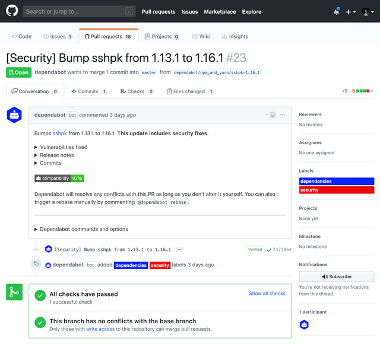

## Design an authentication and authorization strategy

### Design an access solution (Azure AD Privileged Identity Management (PIM), Azure AD Conditional Access, MFA, Azure AD B2B, etc.)

#### Azure Active Directory

Azure AD is a cloud-based identity management solution. It helps your company's internal users to:

- Access external resources, like Azure services, Microsoft 365, and third-party SaaS applications.
- Access internal resources such as applications on your corporate network, and cloud-based applications that your company builds.

Azure AD stores your users in a **tenant** that **represents an organization**.

#### Azure AD vs. Active Directory

|Service|Authentication|Structure|What it's used for|
|-|-|-|-|
|Active Directory|Kerberos, NTLM|Forests, domains, organizational units|Authentication and authorization for on-premises printers, applications, file services, and more|
|Azure Active Directory|Includes SAML, OAuth, WS-Federation|Tenants|Internet-based services and applications like Microsoft 365, Azure services, and third-party SaaS applications|

#### Hybrid identity

Your users will want to access applications from both the cloud and on-premises.
You can use Azure AD and Active Directory together to provide an identity solution that **spans on-premises and the cloud**.

Multiple authentication methods let you achieve hybrid identity for users:

- **Azure AD password hash synchronization**: Here, the user's password is hashed twice and synchronized between the on-premises Active Directory and Azure AD. Users have the same credentials to access resources and applications both on-premises and in the cloud.
- **Azure AD pass-through authentication**: Here, an agent is installed on on-premises servers that authenticate against the on-premises Active Directory. When an Azure AD user account tries to authenticate, password authentication is handled on-premises through these servers and Active Directory.
- **Federated authentication**: Here, the authentication process is performed by an on-premises Active Directory Federation Services (AD FS) server that validates users' passwords.

|You want to:|Password hash synchronization|Pass-through authentication|Federated authentication|
|-|-|-|-|
|Automatically synchronize to the cloud the users, contacts, and groups that have been set up on on-premises Active Directory.|Yes|Yes|Yes|
|Allow users to access cloud applications and resources by using their on-premises password.|Yes|Yes|Yes|
|Ensure that password hashes aren't stored in the cloud.|No|Yes|Yes|
|Use cloud-based multi-factor authentication.|Yes|Yes|Yes|
|Use on-premises multi-factor authentication.|No|No|Yes|
|Use smart card authentication for additional protection.|No|No|Yes|

#### Azure AD licenses

You can use different features of Azure AD, depending on the type of license you choose:

- **Azure Active Directory Free**: manage users and groups, and you get necessary reports, on-premises Active Directory synchronization, and self-service password reset for Azure AD users.
- **Pay-as-you-go licenses for specific features**: You access specific Azure AD features, like **Azure AD B2C**, on a pay-as-you-go basis. Azure AD B2C lets you manage identity and access for consumer users and the applications they use.
- **Office 365 Apps**: You get all of the free tier features, but you can also have **custom login and logout pages**, **self-service password reset for cloud users** and d**evice write-back**.
- **Azure Active Directory Premium P1**: You can use **self-service group management or dynamic groups**, where users are added and removed automatically, based on your criteria. This tier supports on-premises identity management suites like **Microsoft Identity Manager**.
- **Azure Active Directory Premium P2**: You get all the features of the previous two tiers, along with **Active Directory Identity Protection**.

#### Default user permissions

Azure AD gives all of the users in your tenant a default set of permissions. Permissions dictate what a user can and can't do.

|Area|Member user permissions|Guest-user permissions|
|-|-|-|
|Users and contacts|Can view all profile details. Can change own password, mobile phone number, and profile photos.|Can view only profile name, email, sign-in name, photo, user principal name, and user type properties of other users and contacts. Can change own password.|
|Devices|Can read all properties of devices. Can manage all properties of owned devices.|Can't read all properties of devices. Can't manage all properties of owned devices. Can delete owned devices.|
|Applications|Can register new applications.|Can't register new applications. Can delete owned applications.|
|Policies|Can read all properties of policies and manage all properties of owned policies.|No permissions.|
|Subscriptions|Can read all subscriptions and enable service plan members.|No permissions.|
|Roles and scopes|Can read all administrative roles and memberships. Can read all roles and scopes and membership of administrative units.|No permissions.|

#### Azure Active Directory Main Features

##### Azure AD B2B

Use Azure AD to **invite external users to your tenant**.
Your organization can then collaborate with external healthcare partner staff members through Azure AD B2B Collaboration.

##### Azure AD B2C

You can also use Azure AD B2C to manage your customers' identities and access.

##### Azure AD DS

Azure AD DS lets you add virtual machines to a domain without needing domain controllers. Your internal staff users can access virtual machines by using their company Azure AD credentials.

##### App management

Your company might provide many apps that internal and external users rely on.
You can manage different categories of apps in Azure AD:

- **Azure AD App Gallery applications**: Thousands of SaaS apps are integrated with Azure AD.
- **Custom applications**: You can register your company-built apps with Azure AD. You then control and monitor authentication for these apps.
- **Non-gallery applications**: You can manually add any apps that you don't see in the gallery.
- **On-premises applications**: You can add on-premises apps by configuring Azure AD Application Proxy

##### Azure AD Conditionnal Access

Use conditional-access policies to require users to pass additional authentication challenges before they access an app.

##### Azure AD Identity Protection

Azure AD Identity Protection helps you to automatically detect, investigate, and remediate identity risks for users.

By using automated risk detection and remediation through Identity Protection, the admin first configures the risk policies.

These policies then monitor for identity risks. When a risk is detected, the policies enforce measures to remediate it. For example, a policy might require a user to reset their password in response to a detected risk. The user then resets their password, and the risk is remediated.

##### Password Writeback

Password writeback is a feature of Azure AD Connect which ensures that when a password changes in Azure AD (password change, self-service password reset, or an administrative change to a user password) it is written back to the local AD.

##### Azure AD Connect Health

Azure Active Directory (Azure AD) Connect Health provides robust monitoring of your on-premises identity infrastructure. It enables you to maintain a reliable connection to Microsoft 365 and Microsoft Online Services.

##### Identity secure score in Azure AD

If you're an administrator, you need to know how secure your Azure AD tenant is. The identity secure score can help you understand.

### Implement Service Principals and Managed Identity

#### Authentication with service principals in Azure AD

Think of an **Azure service principal as a proxy account**, or identity, that represents your app or service. This account is managed by Azure Active Directory (Azure AD).

Service principals exist at the **tenant level** in Azure. They're used to grant access to resources in that tenant.

If all of the resources are in the same tenant, then you need to associate only one service principal. If your app needs access to Azure resources in a different tenant, then you need a service principal for each tenant.

##### Microsoft Identity Platform

Microsoft identity platform simplifies the way your application authenticates with Azure AD. It provides a unified way to authenticate your apps.

1. When an application successfully authenticates with Azure AD, it receives a unique token.
2. The application uses this token each time it makes a call to an API, or a call to access a service.

To build an application, use Microsoft Authentication Library (MSAL) to provide single sign-on support.

**Azure Resource Manager is the framework that a custom application uses to connect or authenticate to Azure resources.**

Azure AD applications must be assigned roles so that they can work with other services. Azure uses role-based access control (RBAC) to tightly manage access to Azure resources, and manage how those resources are used. An application's roles determine its permissions and scope.

To authenticate requests, the application needs credentials. The credentials allow the application to identify itself. Choose from two forms of credentials:

- **Certificate**: You generate a certificate locally, and then upload the .cer, .pem, or .crt file.
- **Client secret**: This complex secret string is generated in Azure.

**An authorization request requires a tenant ID, application ID, and authentication key.**

#### Authentication with managed identities

Azure managed identity is a feature of Azure Active Directory (Azure AD) that you can use free of charge. This feature automatically creates identities to allow apps to authenticate with Azure resources and services.

**Managed identities can be used only in Azure resources or through Azure AD integration.**

A managed identity combines Azure AD authentication and Azure role-based access control (RBAC). For system-assigned identities, setting up a managed identity is as easy as switching on a toggle.

When you work with managed identities, you should know some common terms:

- **Client ID**: A unique ID that's linked to the Azure AD application and service principal that was created when you provisioned the identity.
- **Object ID**: The service principal object of the managed identity.
- **Azure Instance Metadata Service**: A REST API that's enabled when Azure Resource Manager provisions a VM. The endpoint is accessible only from within the VM.

You can create two types of managed identity:

- **System-assigned managed identity**: You enable system-assigned identity directly on an Azure service instance, such as a VM. The status of the managed identity is directly linked to the status of the resource. If the resource is deleted, so is the managed identity.
- **User-assigned managed identity**: A user-assigned identity isn't tied to a specific resource, so you can assign it to more than one application.

### Design an application access solution using Azure AD B2C

### Configure service connections

Service connection is a critical resource for various workflows in Azure DevOps like Classic Build and Release pipelines, YAML pipelines, KeyVault Variable groups etc. Based on the usage patterns, service connection security is divided into three categories in the service connections new UI.

- **User permissions**: You can control who can create, view, use, and manage the service connection with user permissions.
  - *Creator*: Members of this role can create the service connection in the project. Contributors are added as members by default.
  - *Reader*: Members of this role can view the service connection.
  - *User*: Members of this role can use the service connection when authoring build or release pipelines or authorize yaml pipelines.
  - *Administrator*: In addition to using the service connection, members of this role can manage membership of all other roles for the service connection in the project
- **Pipeline permissions**: Pipeline permissions control which YAML pipelines are authorized to use this service connection. This is interlinked with 'Allow pipeline access' checkbox you find in service connection creation dialogue.
- **Project permissions**: The project level permissions are the user permissions with reader, user, creator and administrator roles, as explained above, within the project scope.

Service connections enable you to connect to external and remote services to **execute tasks in a job**.

To manage service connection, within Azure DevOps, open the Service connections page from the project settings page.


To manage the security for a connection, within Azure DevOps, open the Service connections page from the project settings page.
Then go to the more options at the top-right corner and choose **Security**.

## Design a sensitive information management strategy

### Evaluate and configure vault solution (Azure Key Vault, Hashicorp Vault)

#### Azure Key Vault

Azure Key Vault is a centralized cloud service for storing application secrets such as encryption keys, certificates, and server-side tokens. Key Vault helps you control your applications' secrets by keeping them in a single central location and providing secure access, permissions control, and access logging.

There are three primary concepts used in an Azure Key Vault:

- **Vaults**: Each key vault is a collection of cryptographic keys and cryptographically protected data (call them "secrets") managed by one or more responsible individuals within your organization.
- **keys**: A given key in a key vault is a cryptographic asset destined for a particular use.
  - **Hardware-protected keys**: The Key Vault service supports using hardware security modules (HSMs) that provide a hardened, tamper-resistant environment for cryptographic processing and key generation.
  Azure has dedicated HSMs validated to **FIPS 140-2 Level 2** that Key Vault uses to generate or store keys.
  - **Software-protected keys**: Key Vault can also generate and protect keys using software-based RSA and ECC algorithms.  general, software-protected keys offer most of the features as HSM-protected keys except the FIPS 140-2 Level 2 assurance:
    - Your key is still isolated from the application (and Microsoft) in a container that you manage.
    - It's stored at rest encrypted with HSMs.
    - You can monitor usage using Key Vault logs.
  **For production use, it's recommended to use HSM-protected keys and use software-protected keys in only test/pilot scenarios.**
- **secrets**: Secrets are small (less than 10K) data blobs protected by a HSM-generated key created with the Key Vault. Secrets exist to simplify the process of persisting sensitive settings that almost every application has: storage account keys, .PFX files, SQL connection strings, data encryption keys, etc.

Key vault uses:

- **Secrets management**: Azure Key Vault can **securely store (with HSMs) and tightly control access** to tokens, passwords, certificates, API keys, and other secrets.
- **Key management**: Azure Key Vault is a cloud-based key management solution, making it easier to **create and control the encryption keys used to encrypt your data**. Azure services such as App Service integrate directly with Azure Key Vault and can decrypt secrets without knowledge of the encryption keys.
- **Certificate management**: Azure Key Vault is also a service that lets you easily **provision, manage, and deploy public and private SSL/TLS certificates** for use with Azure and your internal connected resources. It can also request and renew TLS certificates through partnerships with certificate authorities, providing a robust solution for certificate lifecycle management.

##### Management

- **Authentication**: Azure Key Vault uses Azure Active Directory (Azure AD) to authenticate users and apps that try to access a vault.
- **Authorization**: Management operations (creating a new Azure Key Vault) use role-based access control (RBAC). There is a built-in role Key Vault Contributor that provides access to management features of key vaults, but doesn't allow access to the key vault data.
- **Restricting network access**: Another point to consider with Azure Key Vault is what services in your network can access the vault. **In most cases, the network endpoints don't need to be open to the Internet.**

##### Best Practises Key Vault

- Use RBAC's predefined roles
- Use RBAC to control what users have access to.
- Azure Resource Manager can securely deploy certificates stored in Azure Key Vault to Azure VMs when the VMs are deployed.
- Enable the soft delete and purge protection features of Key Vault, particularly for keys that are used to encrypt data at rest.

### Manage security certificates

<https://docs.microsoft.com/en-us/learn/modules/configure-and-manage-azure-key-vault/5-manage-certificates>

### Design a secrets storage and retrieval strategy (KeyVault secrets, GitHub secrets, Azure Pipelines secrets)

### Formulate a plan for deploying secret files as part of a release

## Develop security and compliance

### Automate dependencies scanning for security (container scanning, OWASP)

### Automate dependencies scanning for compliance (licenses: MIT, GPL)

#### Managing Open-source security and license with WhiteSource

WhiteSource is the leader in continuous open source software security and compliance management.

WhiteSource provides WhiteSource Bolt, a lightweight open source security and management solution developed specifically for integration with Azure DevOps and Azure DevOps Server.

1. In your Azure DevOps Project, under **Pipelines** section, go to White Source Bolt tab, provide your **Work Email, Company Name** and click *Get Started* button to start using the *Free version*.
2. Trigger a build
3. Analyzes the reports

#### Snyk for Azure Pipelines

Snyk integrates across the Azure suite of tools, from Azure Repos through to Azure DevOps, Azure Functions—as well as Azure Container Registry and Azure Kubernetes Service on the container side.

### Assess and report risks

### Design a source code compliance solution (e.g., GitHub Code scanning, GitHub Secret scanning, pipeline-based scans, Git hooks, SonarQube, Dependabot, etc.)

#### Secure GitHub Repository Strategy

##### Communicating security policy with SECURITY.md

The most important is the responsible disclosure of information that could lead to security exploits before their underlying bugs can be fixed. Developers looking to report or address security issues look for a **SECURITY.md** file in the root of a repository in order to responsibly disclose their concerns.

##### Keeping sensitive files out of your repository with .gitignore

One technique to help avoid the majority of this risk is to build and maintain **.gitignore** files.

##### Detecting and fixing outdated dependencies with security vulnerabilities

###### Repository dependency graphs

GitHub scans common package manifests, such as **package.json**, **requirements.txt**, and others.

###### Automated dependency alerts

GitHub provides automated dependency alerts that watch your dependency graphs for you. It then cross-references target versions with versions on known vulnerability lists. When a risk is discovered, the project is alerted.

##### Automated dependency updates with Dependabot

Dependabot creates pull requests to keep your dependencies secure and up-to-date.

Here is how it works:

1. Dependabot checks for updates
2. Dependabot opens pull requests
3. You review and merge



#### GitHub Code Scanning

Code scanning is a feature that you use to analyze the code in a GitHub repository to find security vulnerabilities and coding errors. Any problems identified by the analysis are shown in GitHub.

You can set up code scanning by **adding a workflow** to your repository.

You can use code scanning with **CodeQL**, a semantic code analysis engine.

Code scanning with CodeQL supports both compiled and interpreted languages, and can find vulnerabilities and errors in code that's written in the supported languages: C/C++, C#, Go, Java, JavaScript/TypeScript and Python

Code scanning uses **GitHub Actions**, and each run of a code scanning workflow **consumes minutes for GitHub Actions**.

Code scanning is interoperable with third-party code scanning tools that output **Static Analysis Results Interchange Format** (SARIF) data.

When code scanning identifies a problem in a pull request, you can review the highlighted code and resolve the alert.

#### GitHub Secret Scanning

GitHub scans repositories for known types of secrets, to prevent fraudulent use of secrets that were committed accidentally.

You can configure how GitHub scans your repositories for secrets. Once enabled, secret scanning scans for any secrets in your **entire Git history on all branches** present in your GitHub repository

You can also exclude alerts from secret scanning in private repositories using the **secret_scanning.yml** file

```yaml
paths-ignore:
  - "foo/bar/*.js"
```

You can define custom patterns for secret scanning in organizations and private repositories. Custom patterns for secret scanning are specified as **regular expressions**. Secret scanning uses the **Hyperscan library** and only supports Hyperscan regex constructs, which are a subset of PCRE syntax.

Once a secret has been committed to a repository, **you should consider the secret compromised**.
GitHub recommends the following actions for compromised secrets:

- For a compromised GitHub personal access token, delete the compromised token, create a new token, and update any services that use the old token.
- For all other secrets, first verify that the secret committed to GitHub is valid. If so, create a new secret, update any services that use the old secret, and then delete the old secret.

You should use git to remove the unwanted commit and update historical references. Then contact GitHub support to run garbage collection and invalidate the Git cache.

> *Secret scanning is available for all public repositories, and for private repositories owned by organizations where GitHub Advanced Security is enabled.*

#### Git Hooks

Like many other Version Control Systems, Git has a way to fire off custom scripts when certain important actions occur. There are two groups of these hooks: client-side and server-side.

#### SonarQube

SonarQube® is an automatic code review tool to detect bugs, vulnerabilities, and code smells in your code.

#### WhiteSource Bolt

WhiteSource is the leader in continuous open source software security and compliance management. WhiteSource integrates into your build process, irrespective of your programming languages, build tools, or development environments. It works automatically, continuously, and silently in the background, checking the security, licensing, and quality of your open source components against WhiteSource constantly-updated definitive database of open source repositories.

WhiteSource provides WhiteSource Bolt, a lightweight open source security and management solution developed specifically for integration with Azure DevOps and Azure DevOps Server.

The security dashboard shows the vulnerability of the build. This report shows the list of all vulnerable open source components with **Vulnerability Score**, **Vulnerable Libraries**, **Severity Distribution**.


## Design governance enforcement mechanisms

### Protect against security threats

#### Secure DevOps Kit for Azure

The Secure DevOps Kit for Azure (AzSK) was created by the Core Services Engineering & Operations (CSEO) division at Microsoft, to help accelerate Microsoft IT's adoption of Azure.

##### Continuous Assurance

The basic idea behind Continuous Assurance (CA) is to setup the ability to check for "drift" from what is considered a secure snapshot of a system.

#### Tailwind Traders

Tailwind Traders specializes in competitive pricing, fast shipping, and a large range of items. It's looking at cloud technologies to improve business operations and support growth into new markets.

Tailwind Traders runs a mix of workloads on Azure and in its datacenter.

The company needs to ensure that all of its systems **meet a minimum level of security, and that its information is protected from attacks.** The company also needs a way to **collect and act on security events** from across its digital estate.

Tools on Azure can also help Tailwind Traders with this requirement

#### Azure Security Center

Azure Security Center is a monitoring service that provides visibility of your security posture across all of your services, both on Azure and on-premises. The term security posture refers to cybersecurity policies and controls, as well as how well you can predict, prevent, and respond to security threats.

Security Center includes advanced cloud defense capabilities for VMs:

<https://docs.microsoft.com/en-us/learn/modules/protect-against-security-threats-azure/2-protect-threats-security-center>

#### Azure Sentinel

### Implement Azure policies to enforce organizational requirements

Azure Policy is a service in Azure that enables you to create, assign, and manage policies that control or audit your resources.
These policies enforce different rules and effects over your resource configurations so that those configurations stay compliant with corporate standards.

Azure Policy enables you to define both individual policies and groups of related policies, known as **initiatives**.

Azure Policy comes with a number of **built-in policy** and initiative definitions that you can use, under categories such as Storage, Networking, Compute, Security Center, and Monitoring.

Azure Policy can **automatically remediate noncompliant resources** and configurations to ensure the integrity of the state of the resources.

Like a policy assignment, an initiative assignment is an initiative definition that's assigned to a specific scope of a management group, a subscription, or a resource group.

#### Restrict deployments to a specific location by using Azure Policy

Tailwind Traders wants to limit the location where resources can be deployed to the East US region. It has two reasons:

- Improved cost tracking
- Adhere to data residency and security compliance

### Implement Azure Blueprints to enforce organizational requirements

Instead of having to configure features like Azure Policy **for each new subscription**, with Azure Blueprints you can define a repeatable set of governance tools and standard Azure resources that your organization requires.

Azure Blueprints orchestrates the deployment of various resource templates and other artifacts, such as:

- Role assignments
- Policy assignments
- Azure Resource Manager templates
- Resource groups

#### Blueprint Artifacts

Each component in the blueprint definition is known as an **artifact**.

It is possible for artifacts to have no additional parameters (configurations). An example is the Deploy threat detection on SQL servers policy, which requires no additional configuration.

### Implement container scanning (e.g., static scanning, malware, crypto mining)

#### Azure Defender for container registries

To protect the Azure Resource Manager based registries in your subscription, enable Azure Defender for container registries at the subscription level.

The integrated scanner is powered by Qualys, the industry-leading vulnerability scanning vendor.

Azure Defender will then scan:

- All images when they’re pushed to the registry
- Imported into the registry
- Pulled within the last 30 days.

You’ll be charged for every image that gets scanned – once per image.

The scan completes typically within **2 minutes**, but it might take up to 15 minutes. Findings are made available as **Security Center recommendations**
Results are available within the *Sub-Assessments Rest API* or through the *Azure Resource Graph (ARG)*


#### Qualys Container Scanning Connector for Azure DevOps

Requirements:

- A valid Qualys subscription with the Container Security application activated.
- Access to Qualys Container Security application API endpoint from your build host.
- Requires the container sensor for CI/CD environment to be installed on the Azure DevOps build host.
- Azure DevOps CICD tool version 1.0 or later.
- Internet connection for agent to be able to connect to the Qualys Cloud Platform. Install sensor with proxy option if agent is running behind proxy.
- The Azure DevOps services and agents should have an open connection to the Qualys Cloud Platform in order to get data from the Qualys Cloud Platform for vulnerability reporting.

### Design and implement Azure Container Registry Tasks

Azure Container Registry Tasks  provides cloud-based **container image building for platforms including Linux, Windows, and ARM**, and can **automate OS and framework patching** for your Docker containers.

ACR Tasks supports several scenarios to build and maintain container images and other artifacts:

- **Quick task**: Build and push a single container image to a container registry on-demand, in Azure, without needing a local Docker Engine installation.
- **Automatically triggered tasks**:
  - *Trigger on source code update*: Trigger a container image build or multi-step task when code is committed, or a pull request is made or updated, to a public or private Git repository in GitHub or Azure DevOps.
  - *Trigger on base image update*: Automate OS and framework patching
  - *Trigger on a schedule*: Scheduling a task is useful for running container workloads on a defined schedule, or running maintenance operations or tests on images pushed regularly to your registry.
- **Multi-step task**: Extend the single image build-and-push capability of ACR Tasks with multi-step, multi-container-based workflows.

#### Automate OS and framework patching

The power of ACR Tasks to truly enhance your container build workflow comes from its ability to detect an update to a **base image**.

You can set up an ACR task to **track a dependency on a base image** when it builds an application image. When the updated base image is pushed to your registry, or a base image is updated in a public repo such as in Docker Hub, ACR Tasks can automatically build any application images based on it. With this automatic detection and rebuilding, ACR Tasks saves you the time and effort normally required to manually track and update each and every application image referencing your updated base image.

### Design break-the-glass strategy for responding to security incidents

### Implement Azure role-based access control

<https://docs.microsoft.com/en-us/learn/modules/build-cloud-governance-strategy-azure/4-control-access-azure-rbac>

### Implement Resource Locks

Resource locks are a setting that can be applied to any resource to block modification or deletion. Resource locks can set to either **Delete** or **Read-only**. **Delete** will allow all operations against the resource but block the ability to delete it. **Read-only** will only allow read activities to be performed against it, blocking any modification or deletion of the resource.
> *Applying Read-only can lead to unexpected results because some operations that seem like read operations actually require additional actions.*

To make the protection process more robust, you can combine resource locks with Azure Blueprints. Azure Blueprints enables you to define the set of standard Azure resources that your organization requires.

### Implement dedicated physical server

Some organizations must follow regulatory compliance that requires them to be the only customer using the physical machine that hosts their virtual machines.

Azure Dedicated Host provides dedicated physical servers to host your Azure VMs for Windows and Linux.


Azure Dedicated Host:

- Gives you **visibility into, and control over, the server infrastructure** that's running your Azure VMs.
- Helps **address compliance requirements** by deploying your workloads on an isolated server.
- Lets you **choose the number of processors, server capabilities, VM series, and VM sizes** within the same host.

For high availability, you can provision **multiple hosts in a host group**, and deploy your VMs across this group.
VMs on dedicated hosts **can also take advantage of maintenance control**. This feature enables you to control when regular maintenance updates occur, within a 35-day rolling window.

### Create a subscription governance strategy

At the beginning of any cloud governance implementation, you identify a cloud organization structure that meets your business needs.

There are three main aspects to consider when you create and manage subscriptions:

- **Billing**: You can create one billing report per subscription.
- **Access Control**: Every subscription is associated with an Azure Active Directory tenant. Each tenant provides administrators the ability to set granular access through defined roles by using Azure role-based access control.
- **subscription limits**: Subscriptions also have some resource limitations. For example, the maximum number of network Azure ExpressRoute circuits per subscription is 10. **Those limits should be considered during your design phase.** Management groups are also available to assist with managing subscriptions. A management group manages access, policies, and compliance across multiple Azure subscriptions.

### Control authentication for your APIs with Azure API Management

<https://docs.microsoft.com/en-us/learn/modules/control-authentication-with-apim/>

### Cloud Adoption Framework for Azure

<https://docs.microsoft.com/en-us/learn/modules/build-cloud-governance-strategy-azure/2-accelerate-cloud-adoption-framework>