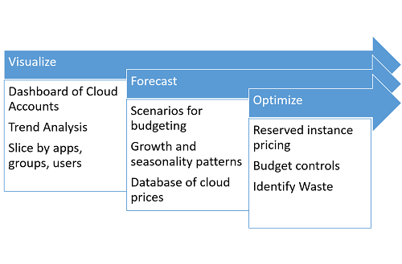
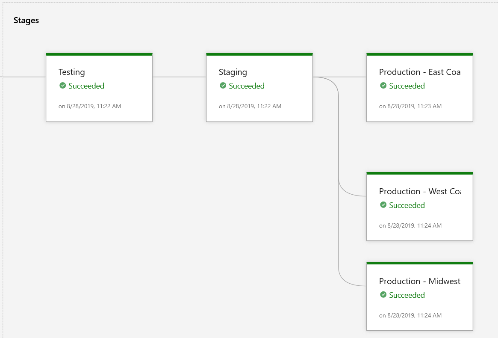
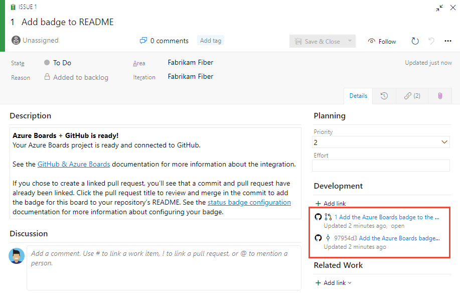
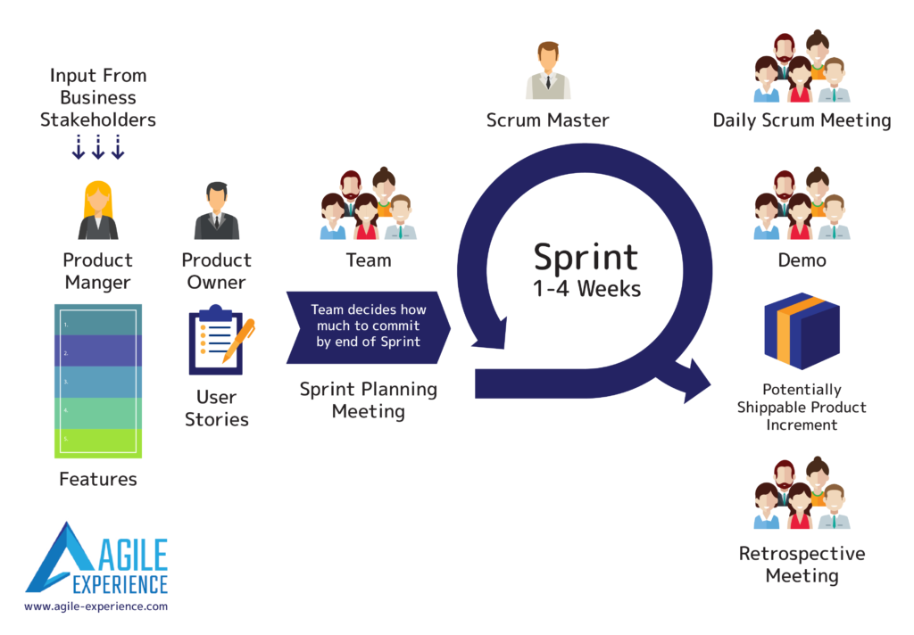
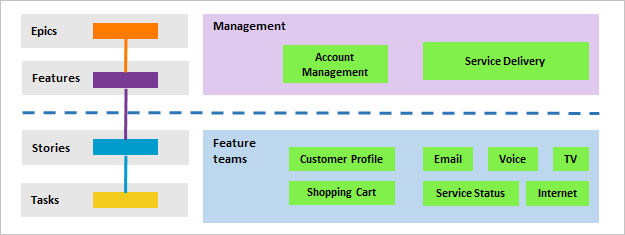
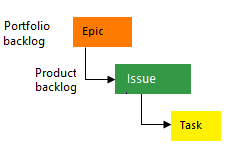
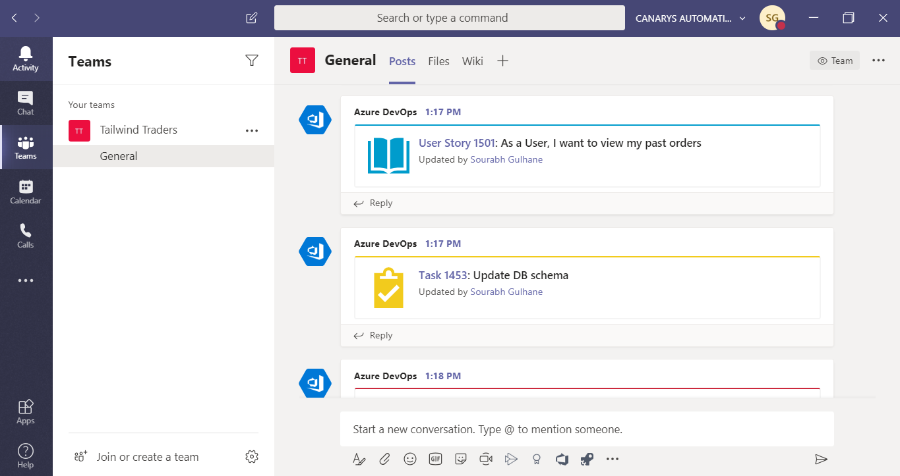

## Communicate deployment and release information with business stakeholders

### Create dashboards combining boards, pipelines (custom dashboards on Azure DevOps)

### Design a cost management communication strategy

#### Cost Introduction

CSPs are taking great pains to attract users from their traditional deployments.
On average, for most major CSPs, prices have fallen by 20-30% per year since 2013.

##### Pricing models

Cloud providers generally charge for resources based on one of the following three types of parameters:

- **Time-based**: Resources are charged based on the amount of time they are provisioned to the user
- **Capacity-based**: Users are charged based on the amount of a particular resource that is utilized or consumed.
- **Performance-based**: Users can select a higher performance level for resources by paying a higher rate.

Based on these charging parameters, CSPs use one of the following common pricing models:

- **On-demand and pay-as-you-go pricing**: Payments are made for a very short period of usage (generally metered in minutes or hours). The advantage is that there is no need for a long-term contract, making it very flexible to scale in and out based on the current need.
- **Reserved instances and subscription-based pricing**: Instead of paying an hourly or per-minute rate, a user can choose to pre-pay and reserve a resource for a fairly long period of time (weeks or months). This often leads to high markdowns (20-50%) but requires a long-term commitment.
- **Spot pricing**: Spot pricing is a way for CSPs to deal with excess unutilized capacity by offering it for sale at significantly lower prices than on-demand resources. The prices are determined by a user auction, where users bid the maximum amount that they are willing to pay for a resource.



1. The first step in attempting to reduce expenditure on the cloud is to match resource types with the actual requirement for the application.
2. It is important to build a monitoring and visualization system to monitor the various resources being used. The monitoring system must be designed to trigger scaling events in response to observed patterns of overload or idleness.
3. it is important to categorize the utilization into different bins, based on the approximate duration for which it will be used.
4. An important technique that ties into cost optimization is that of tagging resources.

### integrate release pipeline with work item tracking (e.g., AZ DevOps, Jira, ServiceNow)

#### Azure DevOps

The release deployments control shows release information for those work items that have been associated to a Git commit which is part of a build being released.

##### Configure release

1. Open Pipelines>Releases, choose to edit your release pipeline, then choose **Options** > **Integrations**.
2. Check the **Report deployment status to Boards** checkbox and choose the stages and deployment types to report.

##### Deployment control

The work item deployment control displays the status of releases within those work items that are associated with commits in the build and those release pipelines you've configured to report deployment information to Azure Boards.



### Integrate GitHub as repository with Azure Boards

To support linking of GitHub commits and pull requests to Azure Boards work items, you connect your Azure Boards project to GitHub.com repositories.

This connection uses the Azure Boards app for GitHub to support the integration between Azure Boards and GitHub.

It is recommend that you use the Azure Boards app for GitHub to configure and manage your connections to GitHub.com.




### Communicate user analytics

## Generate DevOps process documentation

### Design onboarding process for new employees

Anytime you create a project, you must choose a **process** or **process template** based on the process model you use.

- A **process** defines the building blocks of the work item tracking system and supports the Inheritance process model for Azure Boards.
- A **process template** defines the building blocks of the work item tracking system as well as other sub-systems you access through Azure Boards or an on-premises Azure DevOps Server or Team Foundation Server (TFS).

#### Concepts

##### Frameworks

###### Scrum

Scrum is a framework utilizing an agile mindset for developing, delivering, and sustaining products in a complex environment

The fundamental unit of Scrum is a small team of people, consisting of:

- A product owner: The product owner should focus on the business side of product development and spend the majority of time liaising with stakeholders and the team. This role is **crucial** and requires a deep understanding **of both sides**, the business and the engineers in the scrum team.
  - **Represent the product's stakeholders**
  - Represent the **voice of the customer**
  - Responsible for delivering good business results.
  - Accountable for the product backlog and for maximizing the value that the team delivers.
  **It is strongly advised against combining this role with the role of the scrum master.**
- A Scrum Master: The role has also been referred to as a team facilitator or servant-leader to reinforce these dual perspectives
  - Accountable for removing impediments to the ability of the team to deliver the product goals and deliverables.
  - Acts as a barrier between the team and any distracting influences.
  - Ensures that the scrum framework is followed by coaching the team in scrum theory and concepts, often facilitating key sessions, and encourages the team to grow and to improve.
- Developers: refers to anyone who plays a role in the development and support of the system or product, and can include researchers, architects, designers, data specialists, statisticians, analysts, engineers, programmers, and testers, among others
  - Carry out all work required to build increments of value every sprint.

The team is self-managing, cross-functional and focuses on one objective at a time: the product goal.



Here are the ceremonies:

- Sprint Planning Meeting:
  - Agree the sprint goal, a short description of what they forecast to deliver by sprint end, based on the priorities set by the product owner
  - Select product backlog items that contribute towards this goal
  - Form a sprint backlog by mutually discussing and agreeing on which items are intended to be done during that sprint
  **For a 4 week sprint, it should take 8 hours maximum**
  -> 2 week sprint with 50% slack should take 2 hours maximum

- Daily Scrum Meeting:
  - Should happen at the same time and place every day
  - Is focused on inspecting progress towards the sprint goal
  **It should take maximum 15 minutes, no detailed discussions should happen during the daily scrum.**
- Demo
- Retrospective Meeting

#### Agile

##### Recommendations for managing multiple Agile teams

- Build trust in your people and processes
- Elevate the organization above the team (and individual)
- Foster a culture of transparency

##### 

- **Portfolio backlog**: Portfolio backlogs provide product owners insight into the work performed by several agile feature teams. Product owners can define the high-level goals as Epics or Features, and feature teams can break these down into the user stories they'll prioritize and develop.



- **Product backlog**: A product backlog is a list of the new features, changes to existing features, bug fixes, infrastructure changes or other activities that a team may deliver in order to achieve a specific outcome.
- **Issue & Bug Tracking**:
- **Impediment**:
- **Configurable**:

#### Azure Boards

Azure Boards is a tool in Azure DevOps to help teams plan the work that needs to be done.

##### Basic *(Template)*

Choose **Basic** when your team wants the simplest model that uses Issues, Tasks, and Epics to track work.



*Note that The basic process is available with Azure DevOps Server 2019 Update 1 and later versions.*

##### Agile *(Template)*

Choose **Agile** when your team uses Agile planning methods, including Scrum, and tracks development and test activities separately. This process works great if you want to track user stories and (optionally) bugs on the Kanban board, or track bugs and tasks on the taskboard.


##### Scrum *(Template)*

Choose **Scrum** when your team practices Scrum. This process works great if you want to track product backlog items (PBIs) and bugs on the Kanban board, or break PBIs and bugs down into tasks on the taskboard.


##### CMMI *(Template)*

Choose **CMMI** when your team follows more formal project methods that require a framework for process improvement and an auditable record of decisions. With this process, you can track requirements, change requests, risks, and reviews.


### assess and document external dependencies (e.g., integrations, packages)

### assess and document artifacts (version, release notes)

## Automate communication with team members

### integrate monitoring tools with communication platforms (e.g., Teams, Slack, dashboards)

### notify stakeholders about key metrics, alerts, severity using communication and project management platforms (e.g., Email, SMS, Slack, Teams, ServiceNow, etc.)

#### IT Service Management Connector

IT Service Management Connector (ITSMC) allows you to connect Azure to a supported IT Service Management (ITSM) product or service.

Azure services like Azure Log Analytics and Azure Monitor provide tools to detect, analyze, and troubleshoot problems with your Azure and non-Azure resources. But the work items related to an issue typically reside in an ITSM product or service. ITSMC provides a bi-directional connection between Azure and ITSM tools to help you resolve issues faster.

ITSMC supports connections with the following ITSM tools:

- ServiceNow
- System Center Service Manager
- Provance
- Cherwell

##### Teams

###### Prerequisites

- You should have Office365 account in order to integrate Azure DevOps Services with Microsoft Teams.
- Only Azure DevOps organizations in the same organization (AAD tenant) can be used to integrate with your Microsoft Teams account

###### Integrating Microsoft Teams with Azure DevOps Services

**Azure DevOps Services integration** with Microsoft Teams provides a comprehensive chat and collaborative experience across the development cycle.

1. Select your team, click the ellipsis or **‘…‘** right side at the top nav of your team channel, and then select **Connectors**
2. Select **Azure DevOps** connector from the list and click **Add**.
3. Click **Add** to add the connector for your team.

Select your organization (you may be prompted to sign in first), the project and your team. Choose the type of activity you want to be notified about. Depending on the event, you may be given further fields to filter down the notifications so you can filter out notifications your team does not care about.



###### Azure DevOps Kanban board & Dashboards in Teams

1. To bring your Kanban board or Dashboard into Microsoft Teams, click the **+** icon to add new tab. Find the Azure DevOps icon and select **Azure DevOps**.
2. Select the Organization
3. Once you have authenticated and selected your organization, you will be displayed a screen to select a **Kanban board** or **Dashboard**.


###### Azure Pipelines with Microsoft Teams

Azure Pipelines app on Microsoft Teams enables you to monitor the events for your pipelines.

1. Visit the App store in Microsoft Teams and search for the Azure Pipelines app. Select Azure Pipelines app.
2. In the app,click on Add
3. Once the app is added, click on the drop down and select Add to a team
4. Select your team and click on Set up a bot
5. Use the ```@azure pipelines``` handle to start interacting with the app.
6. In Conversations enter ```@Azure Pipelines signin``` and signin.
7. To start monitoring a pipeline, use the following command inside a channel ```@azure pipelines subscribe [pipeline url]```. The pipeline URL can be to any page within your pipeline that has a **definitionId** or **buildId**/**releaseId** present in the URL.
8. The ```@azure pipelines subscriptions``` command lists all of the current subscriptions for the channel and allows you to add/remove subscriptions.

### integrate build and release with communication platforms (e.g., build fails, release fails)

### integrate GitHub pull request approvals via mobile apps

### Delivery Plans

A delivery plan is a visualization of one or more work schedules. It is intended to provide teams and management an overall **view of what each team is planning to produce and when**. This allows decisions to be made that optimize the investments across the organization.

It's important that teams **regularly review** their delivery plans in order to make sure that their work schedule aligns with the schedules of other teams. 

Delivery plans **add value at any point in a project's lifecycle**. Since they are dynamically generated based on team backlogs, they're always up-to-date and offer the latest insights.

Delivery Plans is **an extension for Azure DevOps** that helps organizations plan and review work schedules across multiple teams.

**Creating a delivery plan can be valuable at any point in a project.**

- - - - -

Lead time measures the total time elapsed from the creation of work items to their completion.
Cycle time measures the time it takes for your team to complete work items once they begin actively working on them.
Burndown charts focus on remaining work within a specific time period.
Forecast future sprints and the backlog items that can be completed

<https://docs.microsoft.com/en-us/azure/devops/pipelines/security/overview?view=azure-devops>